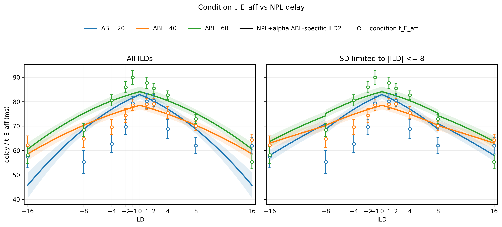

# Results: 2026-06-16

Add result entries below this line.

Each entry should use this shape:

```markdown
## Short result title


*Caption describing what the figure shows.*

Source: `relative/path/to/script.py`
Figure: `docs/assets/results/2026-06-16/example.png`
```

## NPL delay vs condition t_E_aff policy comparison



*Compact comparison of animal-wise NPL + alpha ABL-specific ILD2 delay curves against condition-by-condition t_E_aff estimates after replacing the rerun LED7/92, ABL=20, ILD=+/-1 condition fits. The left panel averages the NPL curves over the full ILD range for all animals; the right panel limits SD animals to their observed |ILD| <= 8 range. Colors show ABL 20, 40, and 60, with across-animal mean +/- SEM.*

Source: `fit_each_condn/compare_3_param_t_E_aff_with_abl_specific_ild2_delay.py`
Figure: `docs/assets/results/2026-06-16/cond_t_E_aff_vs_npl_alpha_abl_specific_ild2_delay_1x2_policy_comparison.png`

## NPL Gamma/Omega vs condition fits


*Comparison of condition-by-condition Gamma and Omega posterior means against Gamma/Omega curves implied by the animal-wise NPL + alpha ABL-specific ILD2-delay fits. Points show condition-fit means +/- SEM across animals; solid curves and shaded bands show model-implied means +/- SEM for ABL 20, 40, and 60.*

Source: `fit_each_condn/compare_cond_gamma_omega_with_npl_alpha_abl_specific_ild2_delay.py`
Figure: `docs/assets/results/2026-06-16/cond_gamma_omega_vs_npl_alpha_abl_specific_ild2_delay.png`

## NPL delay vs condition t_E_aff with unconstrained MSE delay fit


*Comparison of condition-by-condition t_E_aff posterior means against animal-wise NPL + alpha ABL-specific ILD2 delay curves and unconstrained per-animal MSE delay fits. MSE delay uses the same ABL-specific bias + abs(ILD) + ILD^2 form, fit separately for each animal and ABL without coefficient bounds; the figure title reports the across-animal average delay equation for both NPL and MSE fits.*

Source: `fit_each_condn/compare_t_E_aff_with_npl_alpha_abl_specific_ild2_and_mse_delay.py`
Figure: `docs/assets/results/2026-06-16/cond_t_E_aff_vs_npl_alpha_abl_specific_ild2_and_mse_delay.png`

## ABL-specific ILD2 delay posterior bound check


*Overlay of animal-wise posterior histograms for the NPL + alpha + ABL-specific ILD2 delay coefficients. Rows show ABL 20, 40, and 60; columns show bias, abs(ILD) coefficient, and ILD^2 coefficient. Each stepped histogram is one animal, with x-axes spanning the hard VBMC bounds and dotted lines marking saved plausible bounds.*

Source: `fit_animal_by_animal/plot_abl_specific_ild2_delay_posteriors_against_bounds.py`
Figure: `docs/assets/results/2026-06-16/abl_specific_ild2_delay_posteriors_against_vbmc_bounds.png`

## VBMC delay posteriors vs MSE delay coefficients


*Comparison of animal-wise NPL + alpha + ABL-specific ILD2 delay posterior histograms against unconstrained MSE delay coefficients fit from condition-by-condition t_E_aff values. Rows show ABL 20, 40, and 60; columns show bias, abs(ILD) coefficient, and ILD^2 coefficient. Stepped histograms are VBMC posterior samples, dashed vertical lines are the same animal's MSE coefficient, and black vertical lines mark hard VBMC bounds.*

Source: `fit_animal_by_animal/plot_abl_specific_ild2_posteriors_with_mse_coefficients.py`
Figure: `docs/assets/results/2026-06-16/abl_specific_ild2_delay_posteriors_with_mse_coefficients.png`

## RTD Delay Substitution Diagnostic


*Across-animal mean RTD densities by ABL over RT wrt stimulus from -1 to 1 s. Data include valid trials plus abort_event 3 and 4 rows after the batch-specific truncation cutoff: 300 ms for all batches except LED34_even at 150 ms. Curves are normalized over the displayed window after equal signed-ILD averaging within each animal. The model/theory pool remains matched to the fitted NPL + alpha + ABL-specific ILD2 path; the condition-delay diagnostic replaces only t_E_aff with the condition-fit posterior mean.*

Source: `fit_animal_by_animal/compare_rtd_psychometric_abl_specific_delay_vs_condition_delay.py`
Figure: `docs/assets/results/2026-06-16/rtd_abl_specific_delay_vs_condition_delay.png`

## Psychometric Delay Substitution Diagnostic


*Discrete observed/fitted ILD psychometric curves by ABL for data, the original NPL + alpha + ABL-specific ILD2 delay model, and the diagnostic model with only t_E_aff replaced by condition-fit values. SD animals do not contribute nonexistent |ILD|=16 points.*

Source: `fit_animal_by_animal/compare_rtd_psychometric_abl_specific_delay_vs_condition_delay.py`
Figure: `docs/assets/results/2026-06-16/psychometric_abl_specific_delay_vs_condition_delay.png`

## RTD Delay Substitution by ABL and |ILD|


*Across-animal mean RTD densities over -1 to 1 s, split by ABL rows and |ILD| columns. Signed ILDs are averaged equally within each animal after adding abort_event 4 to the data RTD pool and removing early aborts below 300 ms, except LED34_even below 150 ms. Data use 20 ms bins; model curves use the 1 ms grid. The condition-delay diagnostic keeps the NPL + alpha + ABL-specific ILD2 parameters fixed and replaces only t_E_aff with the condition-fit posterior mean.*

Source: `fit_animal_by_animal/compare_rtd_psychometric_abl_specific_delay_vs_condition_delay.py`
Figure: `docs/assets/results/2026-06-16/rtd_by_abl_abs_ild_delay_vs_condition_delay.png`

## RTD Delay Substitution by ABL and |ILD|, Zoomed


*Zoomed version of the ABL-by-|ILD| RTD delay-substitution diagnostic with x-axis limited to -0.6 to 0.6 s. Data include valid trials plus abort_event 3 and 4 rows after the batch-specific truncation cutoff; model curves are unchanged NPL + alpha + ABL-specific ILD2 parameters with only t_E_aff substituted in the condition-delay diagnostic.*

Source: `fit_animal_by_animal/compare_rtd_psychometric_abl_specific_delay_vs_condition_delay.py`
Figure: `docs/assets/results/2026-06-16/rtd_by_abl_abs_ild_delay_vs_condition_delay_xlim_minus0p6_0p6.png`
