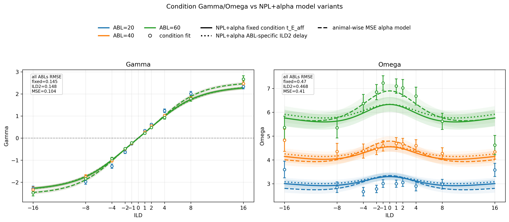
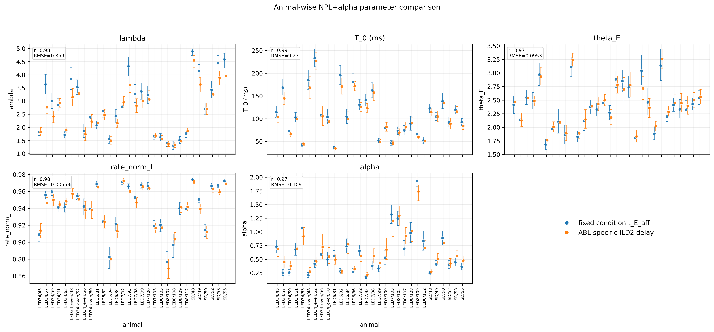

# Results: 2026-06-18

Add result entries below this line.

## Fixed-condition t_E_aff Gamma/Omega comparison

*Gamma and Omega condition-fit posterior means compared with three NPL+alpha-derived model variants: fixed condition `t_E_aff` animal-wise refit (solid), previous ABL-specific ILD2-delay model (dotted), and per-animal MSE alpha-model refit (dashed). Colors indicate ABL 20, 40, and 60; open circles show condition fits.*

Source: `fit_each_condn/compare_cond_gamma_omega_with_npl_alpha_condition_t_E_aff_fixed_delay.py`
Figure: `docs/assets/results/2026-06-18/cond_gamma_omega_vs_npl_alpha_condition_t_E_aff_fixed_delay.png`

## Fixed t_E_aff vs ABL-specific ILD2 animal-wise parameters

*Animal-wise posterior mean parameters from the NPL+alpha fit with condition-specific `t_E_aff` fixed compared with the previous NPL+alpha ABL-specific ILD2-delay fit. Each point is the posterior mean and each vertical error bar is the 95% variational posterior interval from the 2.5% and 97.5% posterior sample quantiles. Blue points are fixed condition `t_E_aff`; orange points are ABL-specific ILD2 delay. Inset values show across-animal Pearson r and RMSE between the two fit families.*

Source: `fit_animal_by_animal/compare_fixed_condition_t_E_aff_vs_abl_specific_ild2_params.py`
Figure: `docs/assets/results/2026-06-18/fixed_condition_t_E_aff_vs_abl_specific_ild2_params.png`

## Gamma/Omega MSE objective cross-prediction

*Per-animal Gamma/Omega alpha-model fits under three MSE objectives: fitting both Gamma and Omega, fitting only Gamma, and fitting only Omega. Columns show Gamma and Omega predictions against condition-fit means. The held-out Gamma-only to Omega prediction goes off scale, showing that Gamma alone does not constrain Omega, while Omega-only still gives a reasonable but worse held-out Gamma prediction.*

Source: `fit_each_condn/explore_gamma_omega_mse_fit_objectives.py`
Figure: `docs/assets/results/2026-06-18/gamma_omega_mse_fit_objective_exploration.png`

## Fixed t_E_aff vs ABL-specific ILD2 w and del_go

*Animal-wise posterior means for del_go and w from the NPL+alpha fit with condition-specific t_E_aff fixed compared with the previous NPL+alpha ABL-specific ILD2-delay fit. Error bars show the 2.5%-97.5% variational posterior interval. del_go is shown in ms; w is unitless.*

Source: `fit_animal_by_animal/compare_fixed_condition_t_E_aff_vs_abl_specific_ild2_w_del_go.py`
Figure: `docs/assets/results/2026-06-18/fixed_condition_t_E_aff_vs_abl_specific_ild2_w_del_go.png`
