# Results: 2026-06-24

Add result entries below this line.

## LED8/105 NumPyro SVI loss

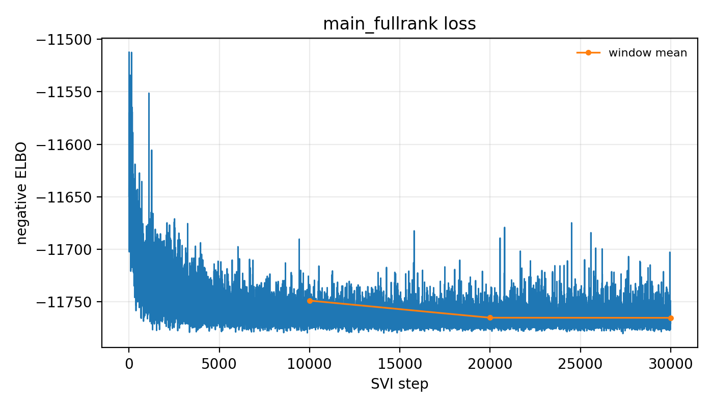

*Negative ELBO over SVI iterations for LED8/105 using the full-rank Gaussian guide. The fit stopped early at 30k steps after the windowed loss plateaued with finite posterior samples.*

Source: `fit_animal_by_animal/numpyro_svi_npl_alpha_condition_delay_single_animal.py`
Figure: `docs/assets/results/2026-06-24/led8_105_main_fullrank_loss.png`

## LED8/105 NumPyro SVI global posterior corner

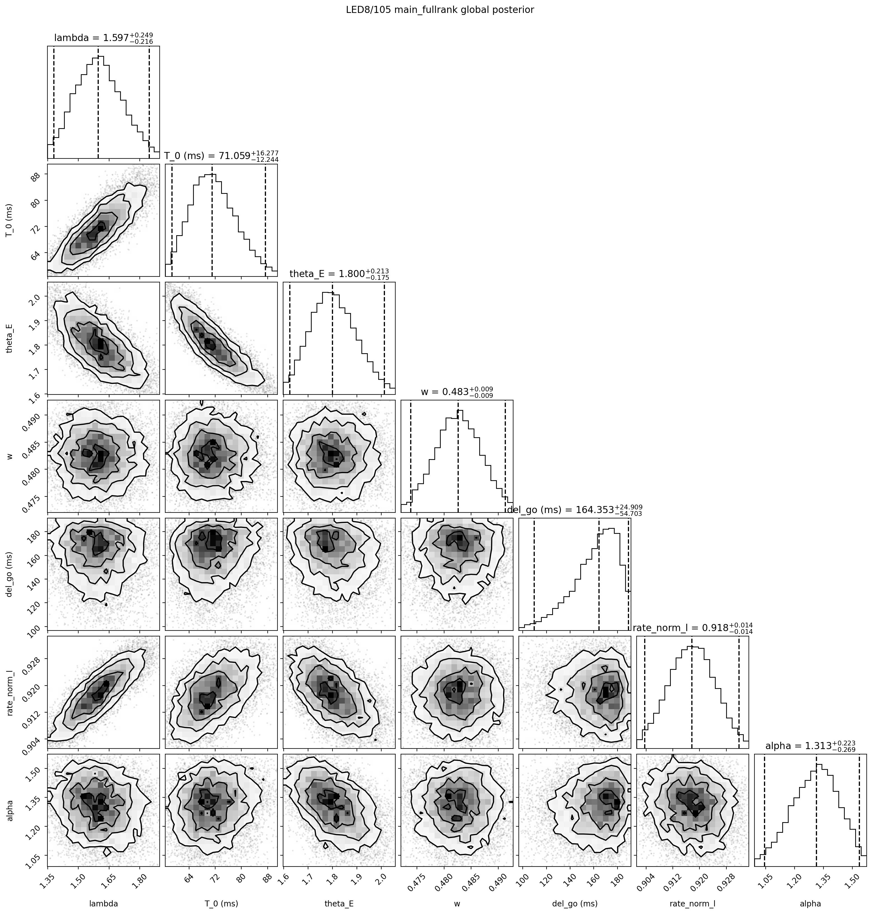

*Global NPL+alpha posterior for LED8/105 from the NumPyro full-rank SVI fit, showing the expected parameter correlations among lambda, T_0, theta_E, w, del_go, rate_norm_l, and alpha.*

Source: `fit_animal_by_animal/numpyro_svi_npl_alpha_condition_delay_single_animal.py`
Figure: `docs/assets/results/2026-06-24/led8_105_main_fullrank_global_corner.png`

## LED8/105 NumPyro SVI selected-delay posterior corner

*Selected-delay corner plot for LED8/105, combining global NPL+alpha parameters with representative per-condition t_E_aff posterior samples.*

Source: `fit_animal_by_animal/numpyro_svi_npl_alpha_condition_delay_single_animal.py`
Figure: `docs/assets/results/2026-06-24/led8_105_main_fullrank_global_selected_delay_corner.png`

## LED8/105 NumPyro SVI condition-delay intervals

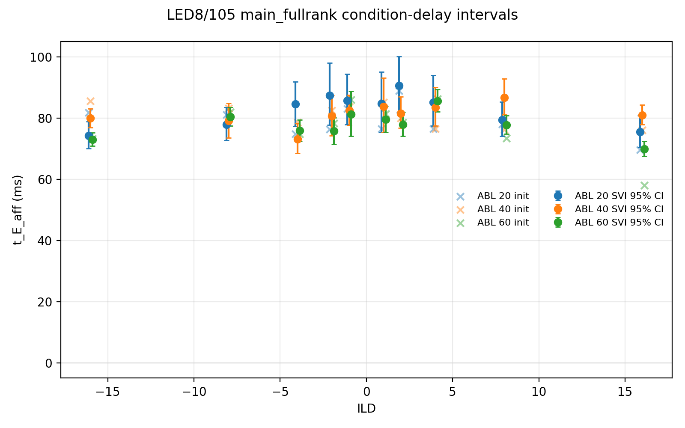

*Per-condition t_E_aff posterior medians and 95% intervals for LED8/105, overlaid with the condition-fit initialization values and separated by ABL.*

Source: `fit_animal_by_animal/numpyro_svi_npl_alpha_condition_delay_single_animal.py`
Figure: `docs/assets/results/2026-06-24/led8_105_main_fullrank_condition_delay_intervals.png`

## LED8/105 NumPyro SVI RTD diagnostics full window

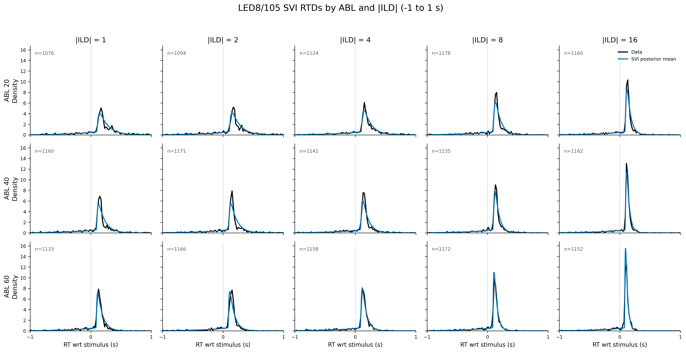

*RTD diagnostics for LED8/105 by ABL and absolute ILD over -1 to 1 s. Data use 20 ms bins with valid trials plus abort events 3 and 4 after truncation; the model uses 1 ms posterior-mean RTD curves.*

Source: `fit_animal_by_animal/diagnose_numpyro_svi_npl_alpha_condition_delay_single_animal.py`
Figure: `docs/assets/results/2026-06-24/led8_105_main_fullrank_rtd_by_abl_abs_ild.png`

## LED8/105 NumPyro SVI RTD diagnostics zoomed window

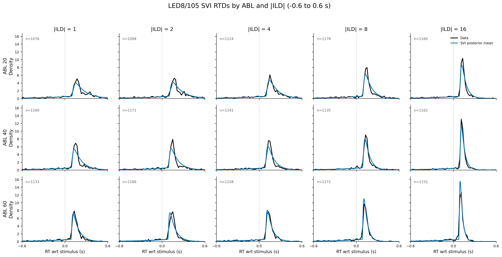

*Same LED8/105 RTD diagnostic as the full-window figure, restricted to -0.6 to 0.6 s to inspect peak timing and width across ABL and absolute ILD.*

Source: `fit_animal_by_animal/diagnose_numpyro_svi_npl_alpha_condition_delay_single_animal.py`
Figure: `docs/assets/results/2026-06-24/led8_105_main_fullrank_rtd_by_abl_abs_ild_zoom.png`

## LED8/105 NumPyro SVI psychometric diagnostics

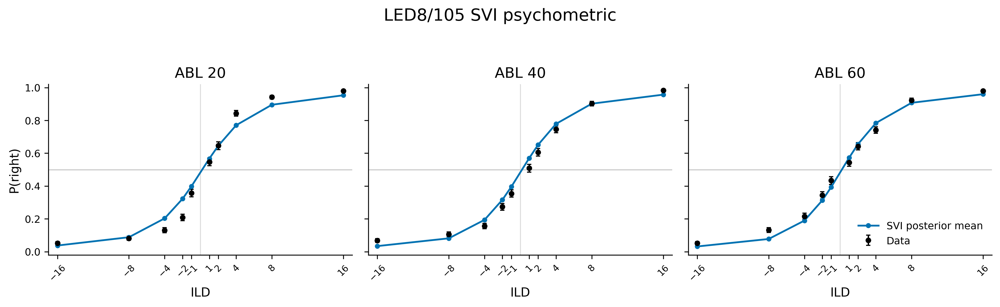

*Psychometric diagnostics for LED8/105 by ABL, comparing valid-trial data with posterior-mean NumPyro SVI model probabilities at the observed discrete ILDs.*

Source: `fit_animal_by_animal/diagnose_numpyro_svi_npl_alpha_condition_delay_single_animal.py`
Figure: `docs/assets/results/2026-06-24/led8_105_main_fullrank_psychometric_by_abl.png`

## All-animal NumPyro SVI RTDs by ABL and absolute ILD

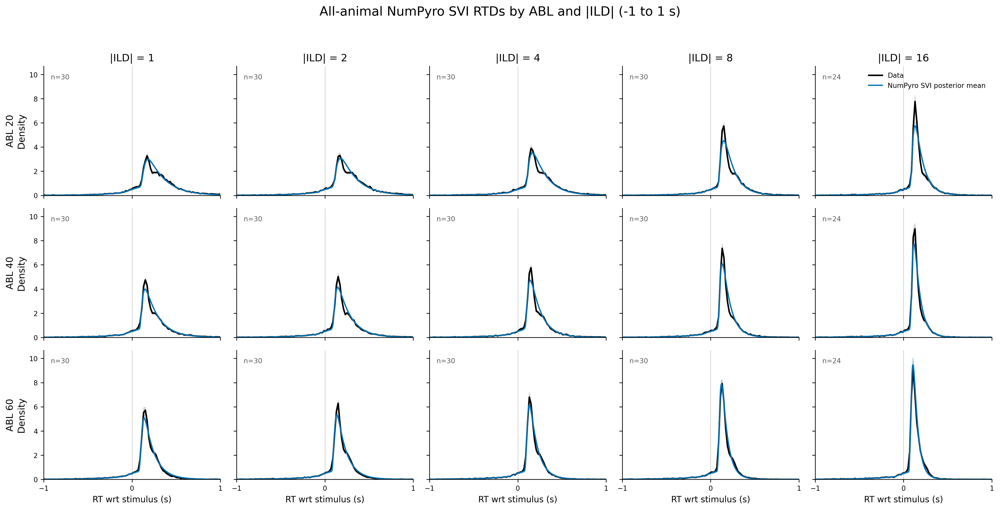

*3x5 all-animal RTD diagnostics over -1 to 1 s by ABL and |ILD|. Signed ILDs are equal-weighted within animal and animals are equal-weighted; SD animals do not contribute |ILD|=16.*

Source: `fit_animal_by_animal/diagnose_numpyro_svi_npl_alpha_condition_delay_all_animals.py`
Figure: `docs/assets/results/2026-06-24/main_fullrank_all_animals_rtd_by_abl_abs_ild.png`

## All-animal NumPyro SVI RTDs by ABL

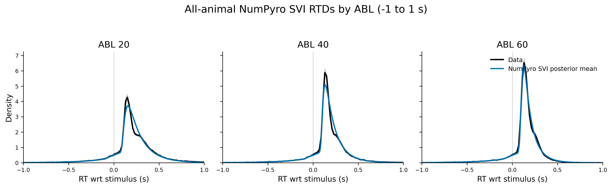

*Across-animal mean +/- SEM RTDs by ABL for the full-rank NumPyro SVI posterior-mean model. Data RTDs use 20 ms bins with valid trials plus abort events 3/4 after batch-specific truncation; model RTDs use 1 ms curves.*

Source: `fit_animal_by_animal/diagnose_numpyro_svi_npl_alpha_condition_delay_all_animals.py`
Figure: `docs/assets/results/2026-06-24/main_fullrank_all_animals_rtd_by_abl.png`

## All-animal NumPyro SVI RTDs by ABL and absolute ILD zoomed

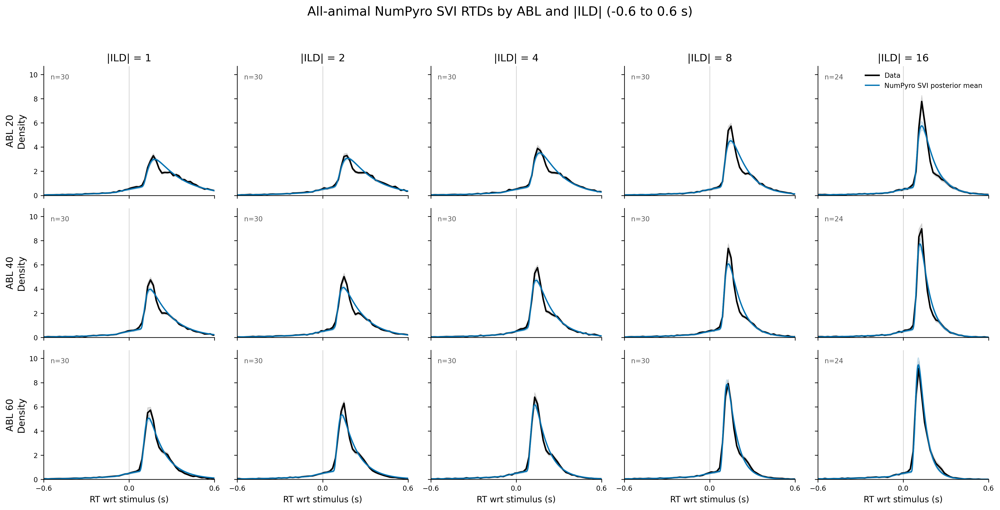

*Same all-animal RTD diagnostics restricted to -0.6 to 0.6 s to inspect peak timing and width.*

Source: `fit_animal_by_animal/diagnose_numpyro_svi_npl_alpha_condition_delay_all_animals.py`
Figure: `docs/assets/results/2026-06-24/main_fullrank_all_animals_rtd_by_abl_abs_ild_zoom.png`

## All-animal NumPyro SVI psychometric diagnostics

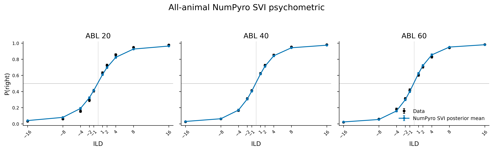

*Across-animal mean +/- SEM psychometric curves by ABL, comparing valid-trial data with full-rank NumPyro SVI posterior-mean probabilities at observed discrete ILDs; missing SD |ILD|=16 points are excluded.*

Source: `fit_animal_by_animal/diagnose_numpyro_svi_npl_alpha_condition_delay_all_animals.py`
Figure: `docs/assets/results/2026-06-24/main_fullrank_all_animals_psychometric_by_abl.png`

## All-animal NumPyro SVI shared parameters by animal

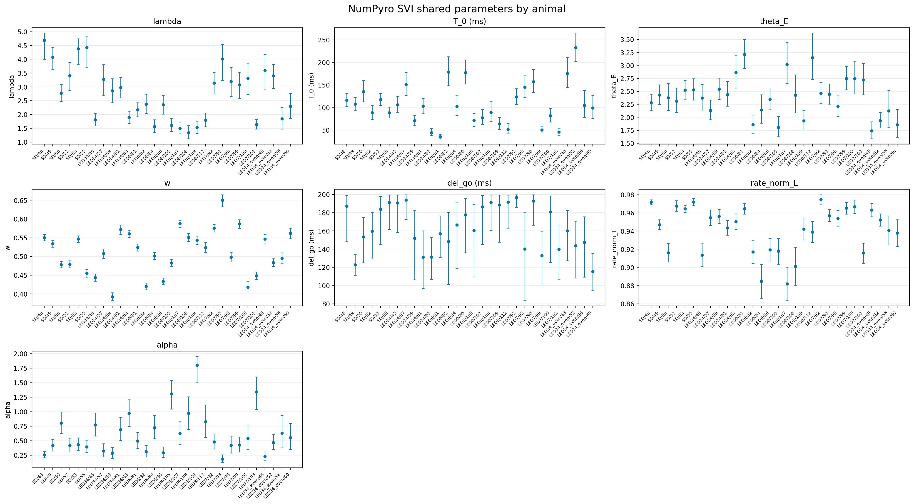

*Posterior means and 95% intervals for the seven shared non-delay NPL+alpha SVI parameters across all 30 animals. T_0 and del_go are shown in ms; the two unused 3 x 3 panels are left blank.*

Source: `fit_animal_by_animal/plot_numpyro_svi_npl_alpha_condition_delay_params_all_animals.py`
Figure: `docs/assets/results/2026-06-24/main_fullrank_all_animals_global_params_by_animal.png`

## All-animal NumPyro SVI condition delays by ABL

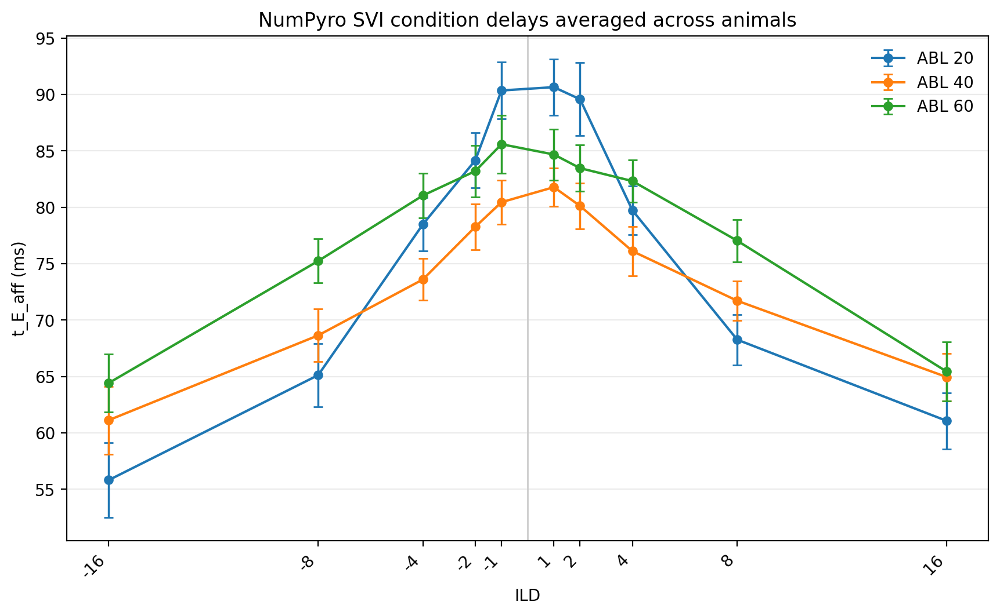

*Across-animal mean t_E_aff versus signed ILD for ABL 20, 40, and 60, with SEM across animals. The |ILD|=16 points include the 24 animals with those conditions; other ILDs include all 30 animals.*

Source: `fit_animal_by_animal/plot_numpyro_svi_npl_alpha_condition_delay_params_all_animals.py`
Figure: `docs/assets/results/2026-06-24/main_fullrank_all_animals_t_E_aff_vs_ild_by_abl.png`

## Fixed condition t_E_aff vs ABL-specific ILD2 shared parameters

*Animal-wise posterior means and 95% intervals for the seven shared non-delay NPL+alpha parameters. Blue points are the refit with condition t_E_aff fixed from condition-by-condition fits; red points are the earlier NPL+alpha ABL-specific ILD2-delay fit. T_0 and del_go are shown in ms.*

Source: `fit_animal_by_animal/compare_fixed_condition_t_E_aff_vs_abl_specific_ild2_params_3x3.py`
Figure: `docs/assets/results/2026-06-24/fixed_condition_t_E_aff_vs_abl_specific_ild2_params_3x3.png`
