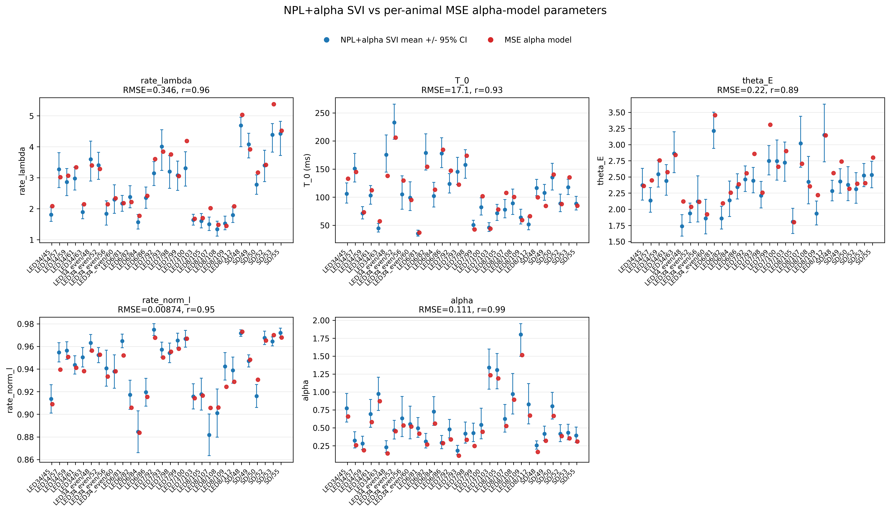

# Results: 2026-06-25

Add result entries below this line.

## Condition SVI Gamma/Omega vs NPL+Alpha SVI

*Consolidated condition-by-condition SVI Gamma/Omega fits compared with Gamma/Omega curves implied by the matching animal-wise NPL+alpha condition-delay SVI posterior means. Points show condition SVI means with SEM across animals, solid lines show NPL+alpha SVI, and dashed lines show per-animal MSE alpha-model fits.*

Source: `fit_each_condn/compare_svi_cond_gamma_omega_with_npl_alpha_svi.py`
Figure: `docs/assets/results/2026-06-25/svi_cond_gamma_omega_vs_npl_alpha_svi.png`

## NPL SVI vs MSE Alpha-Model Parameters

*Animal-wise comparison of NPL+alpha SVI posterior means and 95% intervals against the per-animal MSE alpha-model parameters fitted to condition Gamma/Omega. T_0 is shown in milliseconds; MSE values are plotted without uncertainty intervals.*

Source: `fit_each_condn/compare_npl_svi_vs_mse_gamma_omega_alpha_params.py`
Figure: `docs/assets/results/2026-06-25/npl_svi_vs_mse_alpha_params_by_animal.png`

## NPL SVI vs MSE RT+choice likelihood, total

![Total RT+choice log likelihood on the same [0, 1s] valid fitting trials used by the NPL SVI fits. MSE Gamma/Omega-derived parameters are lower likelihood than NPL SVI posterior-mean parameters in 30/30 animals; mean total delta MSE-NPL = -24.68.](../assets/results/2026-06-25/npl_svi_vs_mse_total_rt_choice_loglike_by_animal.png)

*Total RT+choice log likelihood on the same [0, 1s] valid fitting trials used by the NPL SVI fits. MSE Gamma/Omega-derived parameters are lower likelihood than NPL SVI posterior-mean parameters in 30/30 animals; mean total delta MSE-NPL = -24.68.*

Source: `fit_each_condn/compare_npl_svi_vs_mse_params_rt_choice_loglike.py`
Figure: `docs/assets/results/2026-06-25/npl_svi_vs_mse_total_rt_choice_loglike_by_animal.png`

## NPL SVI vs MSE RT+choice likelihood, per trial

![Per-trial RT+choice log likelihood on the same [0, 1s] valid fitting trials used by the NPL SVI fits. The MSE Gamma/Omega-derived parameters are lower likelihood than NPL SVI posterior-mean parameters in 30/30 animals; mean per-trial delta MSE-NPL = -0.00242.](../assets/results/2026-06-25/npl_svi_vs_mse_per_trial_rt_choice_loglike_by_animal.png)

*Per-trial RT+choice log likelihood on the same [0, 1s] valid fitting trials used by the NPL SVI fits. The MSE Gamma/Omega-derived parameters are lower likelihood than NPL SVI posterior-mean parameters in 30/30 animals; mean per-trial delta MSE-NPL = -0.00242.*

Source: `fit_each_condn/compare_npl_svi_vs_mse_params_rt_choice_loglike.py`
Figure: `docs/assets/results/2026-06-25/npl_svi_vs_mse_per_trial_rt_choice_loglike_by_animal.png`

## NPL SVI vs MSE RT+choice likelihood delta

![Animal-wise RT+choice log likelihood delta, defined as MSE Gamma/Omega-derived params minus NPL SVI posterior-mean params, on the same [0, 1s] valid fitting trials used by NPL SVI. Both total and per-trial deltas are below zero for all 30 animals; mean per-trial delta = -0.00242.](../assets/results/2026-06-25/npl_svi_vs_mse_rt_choice_loglike_delta_by_animal.png)

*Animal-wise RT+choice log likelihood delta, defined as MSE Gamma/Omega-derived params minus NPL SVI posterior-mean params, on the same [0, 1s] valid fitting trials used by NPL SVI. Both total and per-trial deltas are below zero for all 30 animals; mean per-trial delta = -0.00242.*

Source: `fit_each_condn/compare_npl_svi_vs_mse_params_rt_choice_loglike.py`
Figure: `docs/assets/results/2026-06-25/npl_svi_vs_mse_rt_choice_loglike_delta_by_animal.png`
