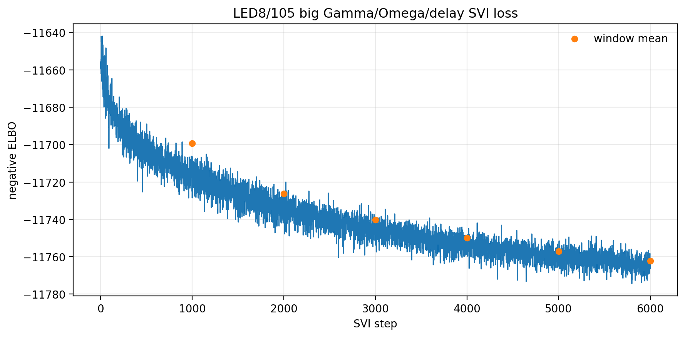
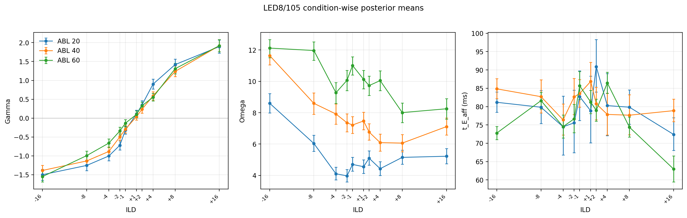
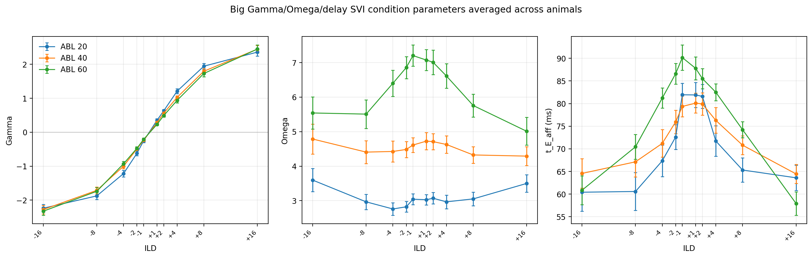

# Results: 2026-06-26

Add result entries below this line.

## Big Gamma/Omega/delay SVI smoke fit loss

*LED8/105 single-animal SVI fit with condition-wise gamma, omega, and t_E_aff plus global w and del_go. The negative ELBO stayed finite and improved, stopping at 6000 of 20000 steps by the stable-window criterion.*

Source: `fit_each_condn/svi_big_gamma_omega_delay_single_animal.py`
Figure: `docs/assets/results/2026-06-26/LED8_105_big_gamma_omega_delay_loss.png`

## Big Gamma/Omega/delay SVI condition parameters

*Posterior means and 95% intervals for LED8/105 condition-wise gamma, omega, and t_E_aff from the 92-parameter SVI fit, plotted as three parameter panels with ABL 20/40/60 separated by color.*

Source: `fit_each_condn/svi_big_gamma_omega_delay_single_animal.py`
Figure: `docs/assets/results/2026-06-26/LED8_105_big_gamma_omega_delay_condition_params.png`

## Big Gamma/Omega/delay SVI all-animal condition parameters

*Across-animal mean +/- SEM of posterior means for condition-wise gamma, omega, and t_E_aff from the completed big Gamma/Omega/delay SVI fits. ABL 20/40/60 are separated by color; |ILD|=16 points use 24 animals and all other ILDs use 30 animals.*

Source: `fit_each_condn/plot_svi_big_gamma_omega_delay_all_animals_condition_params.py`
Figure: `docs/assets/results/2026-06-26/big_gamma_omega_delay_all_animals_condition_params.png`

## Big SVI Gamma/Omega per-animal MSE alpha-model comparison

*Across-animal big Gamma/Omega/delay SVI condition means compared with per-animal MSE-fitted alpha-model Gamma/Omega functions. Points show condition posterior-mean averages with SEM; lines and shaded bands show averaged MSE model predictions with SEM. All 30 per-animal MSE fits succeeded; Gamma all-ABL RMSE=0.306, Omega all-ABL RMSE=0.848.*

Source: `fit_each_condn/compare_big_svi_gamma_omega_with_mse_alpha_model.py`
Figure: `docs/assets/results/2026-06-26/big_svi_gamma_omega_with_per_animal_mse_alpha_model.png`

## NPL SVI versus big-SVI MSE alpha parameters by animal

*Animal-wise comparison of old NPL+alpha condition-delay SVI posterior parameters against per-animal MSE alpha-model parameters fit to the big Gamma/Omega/delay SVI condition Gamma/Omega means. Blue points show posterior means with 95% intervals; red points show MSE-fitted values.*

Source: `fit_each_condn/compare_npl_svi_vs_big_svi_mse_alpha_params.py`
Figure: `docs/assets/results/2026-06-26/npl_svi_vs_big_svi_mse_alpha_params_by_animal.png`

## Big SVI no-early-stop convergence audit loss

*Six quick-stopping big gamma/omega/delay SVI animals were rerun for 50k steps with early stopping disabled. Thin solid blue lines show the full 50k continuation, translucent dashed red lines show the original early-stopped trace prefix, and the red vertical line marks the original stop step. Post-stop ELBO gains and posterior-mean RT+choice log-likelihood changes are reported per trial.*

Source: `fit_each_condn/compare_big_gamma_omega_delay_convergence_audit.py`
Figure: `docs/assets/results/2026-06-26/big_gamma_omega_delay_convergence_audit_loss_continuation.png`

## Big SVI no-early-stop Gamma/Omega condition curves

*Gamma and Omega posterior-mean condition curves for six quick-stopping audit animals. Columns are animals, rows are Gamma and Omega, colors separate ABL 20/40/60, solid lines show the 50k no-early-stop rerun, and translucent dashed lines show the original early-stopped fit.*

Source: `fit_each_condn/compare_big_gamma_omega_delay_convergence_audit.py`
Figure: `docs/assets/results/2026-06-26/big_gamma_omega_delay_convergence_audit_gamma_omega_condition_curves.png`
