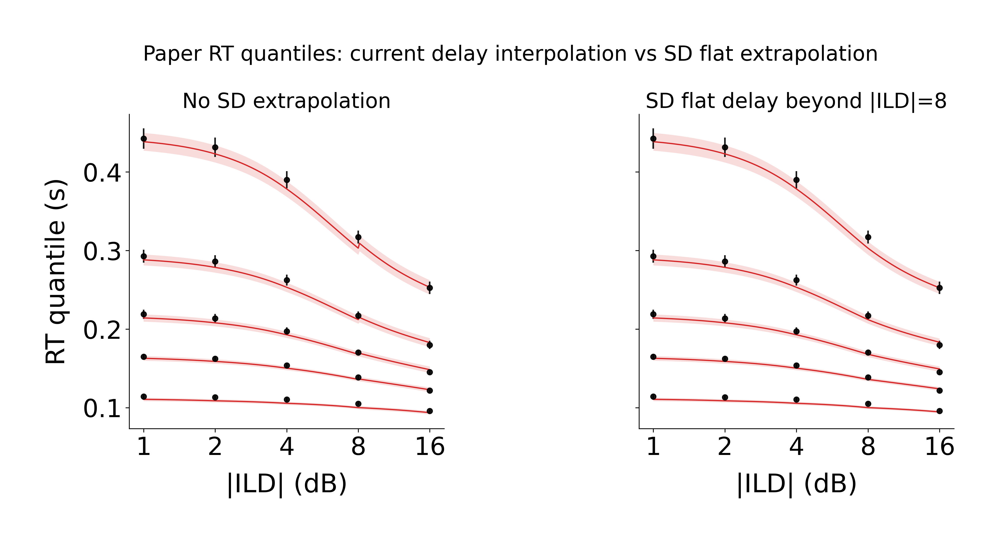
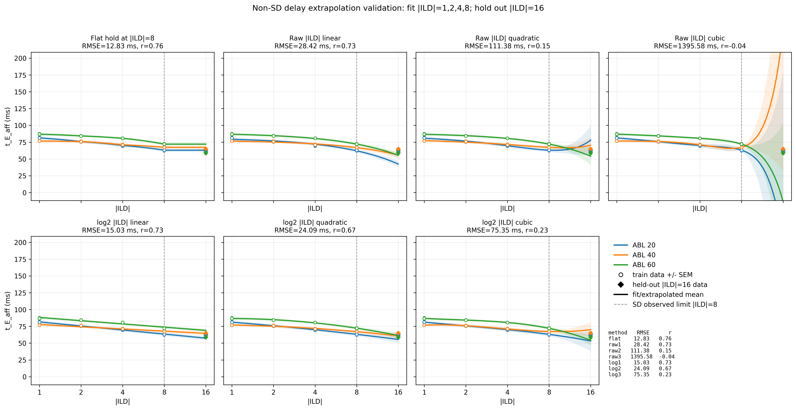
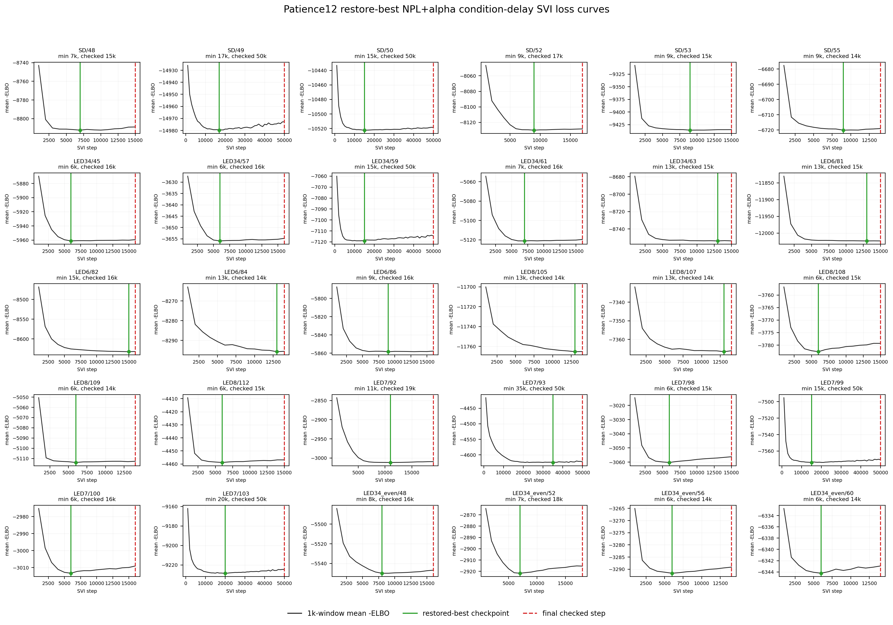

# Results: 2026-06-29

Add result entries below this line.

## MSE NPL-parameter hypothesis test

### Objective variants: fit Gamma+Omega, Gamma-only, Omega-only

  <figure style="flex: 1 1 360px; margin: 0;">
    
    <figcaption><strong>Fit Gamma + Omega.</strong> Across-animal condition Gamma/Omega posterior means from the all-30 patience12 big Gamma/Omega/delay SVI fit compared with per-animal MSE alpha-model curves.</figcaption>
  </figure>
  <figure style="flex: 1 1 520px; margin: 0;">
    
    <figcaption><strong>Figure 4-style diagnostics.</strong> MSE NPL+alpha parameters from the joint Gamma+Omega objective, with patience12 big-SVI `w`, `del_go`, and condition delays.</figcaption>
  </figure>

  <figure style="flex: 1 1 360px; margin: 0;">
    
    <figcaption><strong>Fit Gamma only.</strong> Gamma is the fitted target; Omega is held out and therefore tests whether the same NPL+alpha parameters generalize to the RT scale parameter.</figcaption>
  </figure>
  <figure style="flex: 1 1 520px; margin: 0;">
    
    <figcaption><strong>Figure 4-style diagnostics.</strong> Same downstream psychometric, slope, and RT-quantile test, now using the Gamma-only MSE NPL+alpha parameters.</figcaption>
  </figure>

  <figure style="flex: 1 1 360px; margin: 0;">
    
    <figcaption><strong>Fit Omega only.</strong> Omega is the fitted target; Gamma is held out and tests whether the same NPL+alpha parameters generalize to psychometric drift.</figcaption>
  </figure>
  <figure style="flex: 1 1 520px; margin: 0;">
    
    <figcaption><strong>Figure 4-style diagnostics.</strong> Same downstream psychometric, slope, and RT-quantile test, now using the Omega-only MSE NPL+alpha parameters.</figcaption>
  </figure>

*Single hypothesis-test bundle repeated for three MSE objectives: first fit per-animal NPL+alpha parameters to the big-SVI Gamma/Omega condition means, then use those parameters with patience12 big-SVI `w`, `del_go`, and condition delays to test psychometric, slope, and RT-quantile agreement. SD psychometric/slope model points exclude `|ILD|=16`; quantile diagnostics include continuous interpolated-delay and discrete exact-delay panels for all deciles plus the paper quantiles 10/30/50/70/90, with discrete theory shown as x markers.*

| Objective | Gamma RMSE / r | Omega RMSE / r |
| --- | ---: | ---: |
| Fit Gamma + Omega | 0.312 / 0.976 | 0.883 / 0.905 |
| Fit Gamma only | 0.306 / 0.977 | 6.87e6 / 0.088 |
| Fit Omega only | 0.532 / 0.930 | 0.878 / 0.906 |

Sources: `fit_each_condn/run_patience12_big_svi_gamma_omega_mse_objective_variants.py`; `fit_each_condn/compare_patience12_big_svi_gamma_omega_with_mse_alpha_model.py`; `fit_animal_by_animal/run_figure4_mse_npl_objective_variants_patience12.py`; `fit_animal_by_animal/figure4_mse_npl_params_patience12_big_svi.py`

Figures: `docs/assets/results/2026-06-29/patience12_mse_objective_gamma_omega_gamma_omega.png`; `docs/assets/results/2026-06-29/patience12_mse_objective_gamma_omega_figure4_2x3.png`; `docs/assets/results/2026-06-29/patience12_mse_objective_gamma_only_gamma_omega.png`; `docs/assets/results/2026-06-29/patience12_mse_objective_gamma_only_figure4_2x3.png`; `docs/assets/results/2026-06-29/patience12_mse_objective_omega_only_gamma_omega.png`; `docs/assets/results/2026-06-29/patience12_mse_objective_omega_only_figure4_2x3.png`

## Paper RT quantiles with SD flat delay extrapolation

*Figure-4-style RT quantile check using only the paper quantiles 10/30/50/70/90 and the Gamma+Omega MSE-fit NPL+alpha parameters. The left panel is the current continuous-delay interpolation without SD extrapolation, so `|ILD|=16` model curves use 24 non-SD animals per ABL. The right panel keeps the same model parameters but includes the 6 SD animals beyond `|ILD|=8` by holding `t_E_aff` flat at the signed-branch `|ILD|=8` value; this gives 30 animals per ABL at `|ILD|=16`.*

Source: `fit_animal_by_animal/figure4_mse_npl_params_patience12_big_svi.py`

Figure: `docs/assets/results/2026-06-29/patience12_mse_npl_params_fig4_paper_quantiles_sd_flat_compare.png`

## SD delay extrapolation validation

*Across-animal mean condition-delay curves for the candidate SD extrapolation methods. The validation uses the 24 non-SD animals: fit each animal/ABL/sign branch using `|ILD|=1,2,4,8`, hide `|ILD|=16`, then compare the extrapolated prediction to the observed `|ILD|=16` delay. Flat hold at `|ILD|=8` is visually stable; raw cubic extrapolation is unstable.*

  <figure style="flex: 1 1 420px; margin: 0;">
    
    <figcaption><strong>Held-out |ILD|=16 predictions.</strong> Each point is one non-SD animal, ABL, and sign branch. The simple flat-hold method stays closest to the identity line overall.</figcaption>
  </figure>
  <figure style="flex: 1 1 420px; margin: 0;">
    
    <figcaption><strong>Held-out metrics.</strong> Overall RMSE was 12.83 ms and Pearson `r` was 0.76 for flat hold at `|ILD|=8`; higher-order polynomial extrapolations were much worse.</figcaption>
  </figure>

*Summary: for extrapolating SD-batch delays beyond `|ILD|=8`, the held-out non-SD validation supports using `flat_hold_8` as the default. The script also writes SD extrapolated curves for all tested methods, but the Figure-4-like quantile plots were not regenerated in this step.*

Source: `fit_each_condn/evaluate_sd_delay_extrapolation_methods.py`

Figures: `docs/assets/results/2026-06-29/delay_extrapolation_mean_curves_by_method.png`; `docs/assets/results/2026-06-29/delay_extrapolation_heldout16_pred_vs_actual.png`; `docs/assets/results/2026-06-29/delay_extrapolation_method_metric_summary.png`

## NPL+alpha Condition-Delay SVI Patience12 Loss Grid

*All 30 patience12 restore-best NPL+alpha condition-delay SVI runs are shown as 1k-window mean negative-ELBO curves. Green vertical lines mark the restored-best checkpoint used for posterior sampling; red dashed vertical lines mark the final checked step where the stopping rule stopped. Six animals whose restored-best and final checked steps initially coincided were rerun with `min_steps=50000` and their outputs replaced the early-stopped folders: `SD/49`, `SD/50`, `LED34/59`, `LED7/93`, `LED7/99`, and `LED7/103`. In this updated plot, those six red dashed lines are at 50k; the remaining 24 animals retain the original patience12 run without a 50k minimum.*

Source: `fit_animal_by_animal/plot_numpyro_svi_npl_alpha_condition_delay_patience12_loss_grid.py`

Figure: `docs/assets/results/2026-06-29/npl_alpha_condition_delay_patience12_loss_grid.png`
