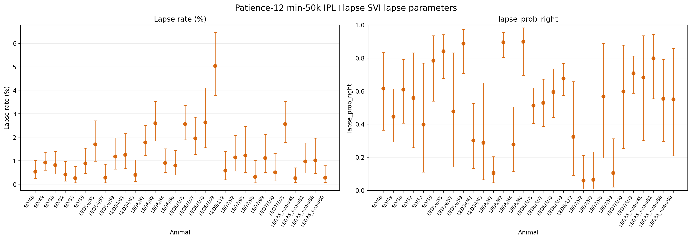
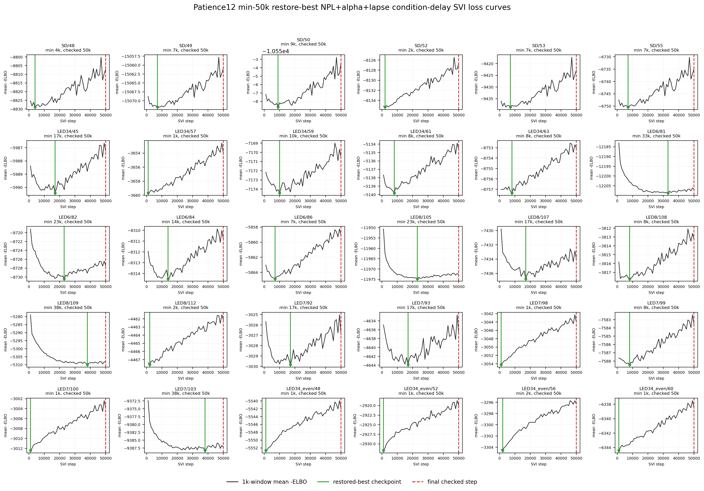

# Results: 2026-07-03

Add result entries below this line.

## IPL + lapse SVI loss curves

*All 30 patience12 min-50k vanilla/IPL + lapse condition-delay SVI loss curves. Black curves show 1k-window mean negative ELBO; green vertical lines mark restored-best checkpoints used for posterior sampling; red dashed lines mark final checked steps. Titles include the no-improvement window count when the restored best is also the final checked step.*

Source: `fit_animal_by_animal/plot_numpyro_svi_vanilla_lapse_condition_delay_patience12_loss_grid.py`
Figure: `docs/assets/results/2026-07-03/vanilla_lapse_condition_delay_patience12_min50k_loss_grid.png`

## IPL versus IPL + lapse SVI parameters

*Posterior-mean comparison of no-lapse IPL and IPL + lapse condition-delay SVI fits. Scalar panels show rate_lambda, T_0, theta_E, w, and del_go by animal; the delay panel shows across-animal mean +/- SEM t_E_aff versus ILD for ABL 20/40/60. Dots mark IPL and crosses mark IPL + lapse.*

Source: `fit_animal_by_animal/compare_ipl_vs_ipl_lapse_condition_delay_params.py`
Figure: `docs/assets/results/2026-07-03/ipl_vs_ipl_lapse_condition_delay_params.png`

## IPL + lapse SVI lapse parameters

*Animal-wise posterior means and 95% intervals for the lapse-specific parameters from the patience12 min-50k IPL + lapse condition-delay SVI fit. The left panel shows lapse_prob as lapse rate percentage; the right panel shows lapse_prob_right directly.*

Source: `fit_animal_by_animal/plot_ipl_lapse_svi_lapse_params_by_animal.py`
Figure: `docs/assets/results/2026-07-03/ipl_lapse_svi_lapse_params_by_animal.png`

## NPL + lapse SVI loss curves

*All 30 patience12 min-50k NPL+alpha + lapse condition-delay SVI loss curves. Black curves show 1k-window mean negative ELBO; green vertical lines mark restored-best checkpoints used for posterior sampling; red dashed lines mark final checked steps.*

Source: `fit_animal_by_animal/plot_numpyro_svi_npl_alpha_lapse_condition_delay_patience12_loss_grid.py`
Figure: `docs/assets/results/2026-07-03/npl_alpha_lapse_condition_delay_patience12_min50k_loss_grid.png`

## NPL versus NPL + lapse SVI parameters

*Posterior-mean comparison of no-lapse NPL+alpha and NPL+alpha + lapse condition-delay SVI fits. Scalar panels show rate_lambda, T_0, theta_E, w, del_go, rate_norm_l, and alpha by animal; the delay panel shows across-animal mean +/- SEM t_E_aff versus ILD for ABL 20/40/60.*

Source: `fit_animal_by_animal/compare_npl_vs_npl_alpha_lapse_condition_delay_params.py`
Figure: `docs/assets/results/2026-07-03/npl_vs_npl_alpha_lapse_condition_delay_params.png`

## NPL + lapse SVI lapse parameters

*Animal-wise posterior means and 95% intervals for lapse-specific parameters from the NPL+alpha + lapse condition-delay SVI fit, overlaid with IPL + lapse posterior means and intervals as x markers. The left panel shows lapse_prob as lapse rate percentage; the right panel shows lapse_prob_right directly.*

Source: `fit_animal_by_animal/plot_npl_alpha_lapse_svi_lapse_params_by_animal.py`
Figure: `docs/assets/results/2026-07-03/npl_alpha_lapse_svi_lapse_params_by_animal_with_ipl_overlay.png`
