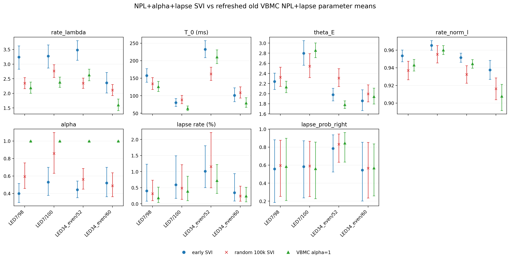

# Results: 2026-07-05

Add result entries below this line.

## NPL lapse reference versus random 100k ELBO curves

*Four suspicious NPL+alpha+lapse SVI animals comparing low-learning-rate reference-initialized reruns whose restored-best checkpoints were at 1k/2k steps against random-plausible low-learning-rate reruns forced to 100k steps. Each panel title includes ELBO; green lines mark the restored-best checkpoint and red dashed lines mark the final checked step.*

Source: `fit_animal_by_animal/plot_npl_alpha_lapse_reference_vs_random_100k_loss_curves.py`
Figure: `docs/assets/results/2026-07-05/npl_alpha_lapse_reference_vs_random_100k_elbo_curves.png`

## NPL Alpha Lapse SVI/VBMC Parameter Comparison

*Posterior parameter means with 95% intervals for the four suspicious animals, comparing early-best NPL+alpha+lapse SVI, random-init 100k SVI, and refreshed old VBMC NPL+lapse. VBMC has no fitted alpha, so alpha is shown as fixed at 1.0.*

Source: `fit_animal_by_animal/compare_npl_alpha_lapse_svi_vbmc_params_elbo_likelihood.py`
Figure: `docs/assets/results/2026-07-05/npl_alpha_lapse_svi_vbmc_parameter_means_ci.png`

## NPL Alpha Lapse SVI/VBMC ELBO And Likelihood

*ELBO/restored objective and common posterior-mean log likelihood for early-best SVI, random-init 100k SVI, and refreshed old VBMC NPL+lapse. Likelihoods are recomputed for all methods with the same NPL+alpha+lapse likelihood; VBMC is evaluated with alpha fixed to 1.0.*

Source: `fit_animal_by_animal/compare_npl_alpha_lapse_svi_vbmc_params_elbo_likelihood.py`
Figure: `docs/assets/results/2026-07-05/npl_alpha_lapse_svi_vbmc_elbo_likelihood.png`
