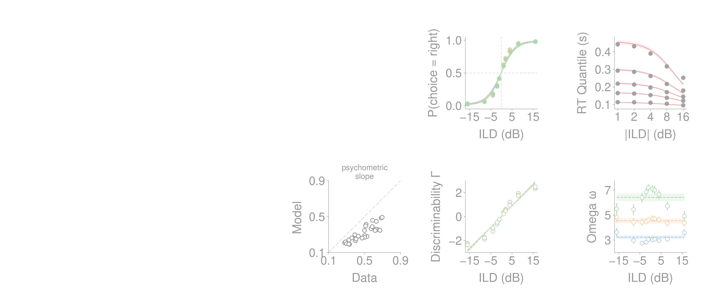

# Results: 2026-07-08

Add result entries below this line.

## Figure 2 v2 with direct IPL SVI condition delays

![Paper Fig. 2-style five-panel diagnostic regenerated from the direct patience12/min50k IPL/vanilla condition-delay SVI fit with condition-wise t_E_aff. The figure uses the Fig2.pdf canvas size, preserves the earlier individual panel sizes, shifts the panel group to the right, nudges the last column slightly farther right, and lifts the bottom row slightly. Psychometric and slope model points omit SD |ILD| > 8; RT quantiles use q10/q30/q50/q70/q90 and the SD flat-delay rule beyond |ILD| = 8. Bottom-row Gamma and Omega panels compare 92-param condition-fit posterior means against IPL functional predictions from the direct SVI parameters.](../assets/results/2026-07-08/figure2_v2_ipl_svi_condition_delay.png)

*Paper Fig. 2-style five-panel diagnostic regenerated from the direct patience12/min50k IPL/vanilla condition-delay SVI fit with condition-wise t_E_aff. The figure uses the Fig2.pdf canvas size, preserves the earlier individual panel sizes, shifts the panel group to the right, nudges the last column slightly farther right, and lifts the bottom row slightly. Psychometric and slope model points omit SD |ILD| > 8; RT quantiles use q10/q30/q50/q70/q90 and the SD flat-delay rule beyond |ILD| = 8. Bottom-row Gamma and Omega panels compare 92-param condition-fit posterior means against IPL functional predictions from the direct SVI parameters.*

Source: `fit_animal_by_animal/figure2_v2/plot_ipl_svi_fig2_v2.py`
Figure: `docs/assets/results/2026-07-08/figure2_v2_ipl_svi_condition_delay.png`

## Figure 2 v2 with direct IPL SVI condition delays, 40% opacity

*40% opacity PNG copy of the Paper Fig. 2-style five-panel diagnostic above. The panel layout and data are identical to the normal-opacity figure; the PNG alpha channel is set to 40% opacity for overlay/layout use.*

Source: `fit_animal_by_animal/figure2_v2/plot_ipl_svi_fig2_v2.py`
Figure: `docs/assets/results/2026-07-08/figure2_v2_ipl_svi_condition_delay_alpha40.png`

## Supplementary lapses figure v2 from SVI fits

![Paper-style 2 x 4 lapses supplementary figure regenerated from the current SVI fits. IPL, NPL, IPL_L, and NPL_L panels use the patience12/min50k animal-wise condition-delay SVI roots; NPL/NPL_L are compact paper labels for the current NPL+alpha and NPL+alpha+lapse SVI fits. Lapse-rate sorting and log-likelihood x-axes use the average of IPL_L and NPL_L posterior-mean lapse probabilities. Common log likelihoods are evaluated at posterior means on the valid RT<1 fitting trials with the model-specific likelihood utilities and batch-specific truncation. The Gamma panel uses no-lapse and lapse big Gamma/Omega/delay SVI condition posterior means, averaging ABLs within animal before SEM across animals.](../assets/results/2026-07-08/svi_lapses_supp_v2_2x4.png)

*Paper-style 2 x 4 lapses supplementary figure regenerated from the current SVI fits. IPL, NPL, IPL_L, and NPL_L panels use the patience12/min50k animal-wise condition-delay SVI roots; NPL/NPL_L are compact paper labels for the current NPL+alpha and NPL+alpha+lapse SVI fits. Lapse-rate sorting and log-likelihood x-axes use the average of IPL_L and NPL_L posterior-mean lapse probabilities. Common log likelihoods are evaluated at posterior means on the valid RT<1 fitting trials with the model-specific likelihood utilities and batch-specific truncation. The Gamma panel uses no-lapse and lapse big Gamma/Omega/delay SVI condition posterior means, averaging ABLs within animal before SEM across animals.*

Source: `fit_animal_by_animal/supplementary_lapses_v2/plot_svi_lapses_supp_v2.py`
Figure: `docs/assets/results/2026-07-08/svi_lapses_supp_v2_2x4.png`

## Figure 4 v2 with Gamma+Omega MSE NPL+alpha parameters

*Paper Figure 4-style diagnostic regenerated for NPL+alpha using animal-wise parameters from the Gamma+Omega MSE fit to the patience12 92-parameter big Gamma/Omega/delay SVI condition means. Psychometric and slope model points omit SD |ILD| > 8; RT quantiles use q10/q30/q50/q70/q90 and the SD flat-delay rule beyond |ILD| = 8; the Gamma and Omega panels compare 92-parameter condition posterior means against NPL+alpha functional predictions from the same Gamma+Omega MSE parameter source.*

Source: `fit_animal_by_animal/figure4_v2/plot_mse_gamma_omega_fig4_v2.py`
Figure: `docs/assets/results/2026-07-08/figure4_v2_mse_gamma_omega_npl_alpha.png`

## Figure 4 v2 with upper-triangular Gamma+Omega MSE parameter matrix

![Combined Figure 4-style diagnostic for NPL+alpha using animal-wise parameters from the Gamma+Omega MSE fit to the patience12 92-parameter big Gamma/Omega/delay SVI condition means. The left block shows psychometric, RT quantiles, Gamma, Omega, and psychometric slopes using the same Figure 4 v2 conventions; the right block imitates the old Figure 4 corner layout but uses an upper-triangular matrix of individual MSE point estimates for lambda_prime, T_0, theta_E, rate_norm_l, and alpha, with light diagonal median guides and without posterior ellipses or error bars.](../assets/results/2026-07-08/figure4_v2_mse_gamma_omega_npl_alpha_with_upper_corner.png)

*Combined Figure 4-style diagnostic for NPL+alpha using animal-wise parameters from the Gamma+Omega MSE fit to the patience12 92-parameter big Gamma/Omega/delay SVI condition means. The left block shows psychometric, RT quantiles, Gamma, Omega, and psychometric slopes using the same Figure 4 v2 conventions; the right block imitates the old Figure 4 corner layout but uses an upper-triangular matrix of individual MSE point estimates for lambda_prime, T_0, theta_E, rate_norm_l, and alpha, with light diagonal median guides and without posterior ellipses or error bars.*

Source: `fit_animal_by_animal/figure4_v2/plot_mse_gamma_omega_fig4_v2_with_upper_corner.py`
Figure: `docs/assets/results/2026-07-08/figure4_v2_mse_gamma_omega_npl_alpha_with_upper_corner.png`
