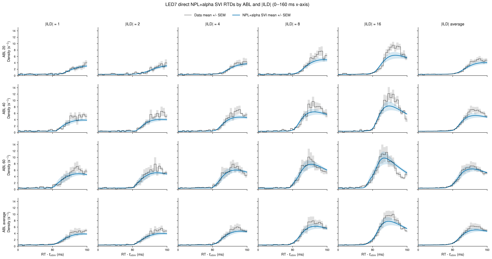
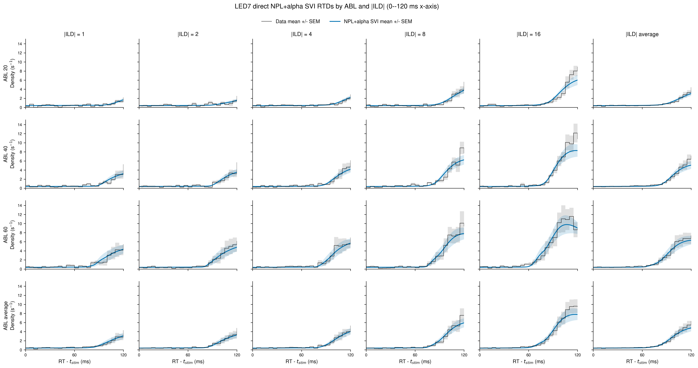
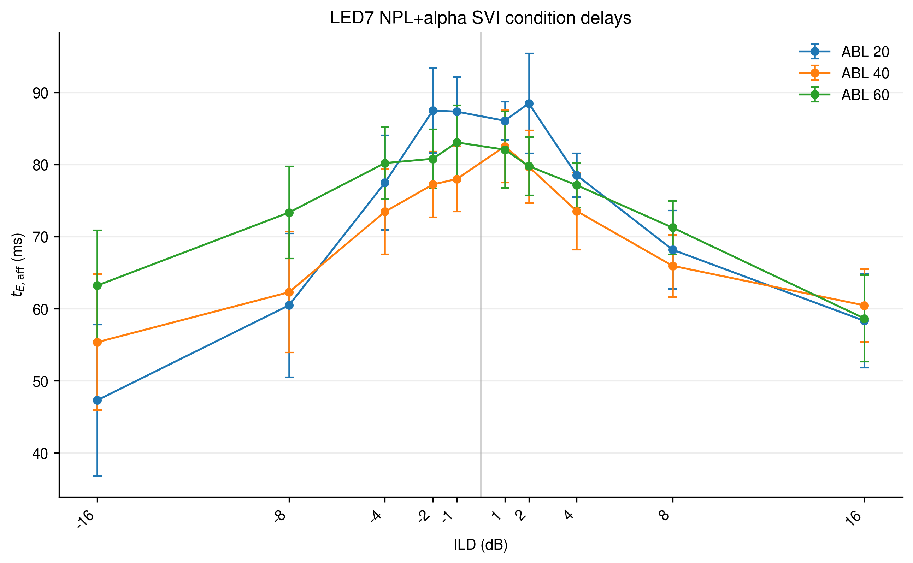
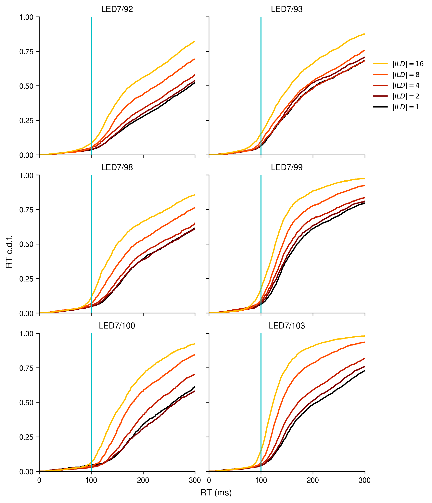

# Results: 2026-07-30

Add result entries below this line.

## LED7 fit-aligned RT quantiles with equal animal averaging

![LED7 q10/q30/q50/q70/q90 reaction-time quantiles for data and the direct patience-12 37-parameter NPL+alpha condition-delay SVI fit. The first three panels show ABL 20/40/60: negative- and positive-ILD quantiles are averaged within each animal, then the six animal values are averaged with SEM. Smooth model curves interpolate each animal's positive and negative t_E_aff branches separately; red x markers identify the five fitted |ILD| values. The final panel uses the Figure 4 ABL-collapse convention, pooling 18 animal-ABL values at each |ILD| before calculating mean and SEM.](../assets/results/2026-07-30/led7_npl_alpha_patience12_fit_aligned_rt_quantiles_equal_animal_1x4.png)

*LED7 q10/q30/q50/q70/q90 reaction-time quantiles for data and the direct patience-12 37-parameter NPL+alpha condition-delay SVI fit. The first three panels show ABL 20/40/60: negative- and positive-ILD quantiles are averaged within each animal, then the six animal values are averaged with SEM. Smooth model curves interpolate each animal's positive and negative t_E_aff branches separately; red x markers identify the five fitted |ILD| values. The final panel uses the Figure 4 ABL-collapse convention, pooling 18 animal-ABL values at each |ILD| before calculating mean and SEM.*

Source: `fitting_aborts/plot_led7_npl_alpha_patience12_fit_aligned_quantiles.py`
Figure: `docs/assets/results/2026-07-30/led7_npl_alpha_patience12_fit_aligned_rt_quantiles_equal_animal_1x4.png`

## LED7 fit-aligned RTDs by ABL and absolute ILD

![Equal-animal LED7 empirical RTDs, including valid trials and retained abort-event 4 trials, compared with direct patience-12 37-parameter NPL+alpha condition-delay SVI predictions and displayed over 0–600 ms. Columns show |ILD| 1/2/4/8/16 plus an equal-|ILD| average; rows show ABL 20/40/60 plus an equal-ABL average. The bottom-right panel averages all 15 ABL-by-|ILD| curves within each animal before calculating mean and SEM across six animals. Negative- and positive-ILD RTDs are normalized over 0–1 s and averaged equally within animal. Data use 5 ms bins and model curves use 1 ms resolution.](../assets/results/2026-07-30/led7_npl_alpha_patience12_fit_aligned_rtds_by_abl_abs_ild_0_1s.png)

*Equal-animal LED7 RTDs compared with direct patience-12 37-parameter NPL+alpha condition-delay SVI predictions. Empirical RTDs use successful trials plus abort events 3/4 from `raw_data/out_LED.csv`, with abort rows retained only when `TotalFixTime >= 300 ms`; within the plotted 0–1 s RT window, event 3 contributes no rows and event 4 contributes 211 rows. Event 5 is excluded. The model remains evaluated on the successful-trial SVI fit pool. Columns show |ILD| 1/2/4/8/16 and an equal average across those five |ILD| values within each animal and ABL. Rows show ABL 20/40/60 and an equal average across ABLs within each animal and |ILD|. The bottom-right panel is the grand average across all 15 ABL-by-|ILD| curves within each animal; every displayed mean and SEM therefore has six independent animal contributors. Negative- and positive-ILD RTDs are normalized and averaged equally within animal. Data use 5 ms bins and model curves use 1 ms resolution. The first three figures reuse the full 0–1 s normalized densities and change only the displayed x-axis to 0–600 ms, 0–160 ms, and 0–120 ms. The fourth figure instead removes density after 120 ms from every signed condition, renormalizes both data and model to unit area over 0–120 ms, and only then performs the same equal-sign, equal-|ILD|, equal-ABL, and equal-animal averaging.*

Source: `fitting_aborts/plot_led7_npl_alpha_patience12_fit_aligned_rtds_by_abl_abs_ild.py`
Figures:

- `docs/assets/results/2026-07-30/led7_npl_alpha_patience12_fit_aligned_rtds_by_abl_abs_ild_0_1s.png`
- `docs/assets/results/2026-07-30/led7_npl_alpha_patience12_fit_aligned_rtds_by_abl_abs_ild_0_160ms_xlim.png`
- `docs/assets/results/2026-07-30/led7_npl_alpha_patience12_fit_aligned_rtds_by_abl_abs_ild_0_120ms_xlim.png`
- `docs/assets/results/2026-07-30/led7_npl_alpha_patience12_fit_aligned_rtds_by_abl_abs_ild_right_truncated_120ms_0_1s.png`

## LED7 condition delay by ILD and ABL

*Across-animal mean and SEM of posterior-mean condition-wise `t_E_aff` for the six LED7 patience-12 NPL+alpha condition-delay SVI fits. Every ABL/ILD point contains all six animals. ABL 20, 40, and 60 are shown in blue, orange, and green, respectively.*

Source: `fitting_aborts/plot_led7_npl_alpha_patience12_fit_aligned_rtds_by_abl_abs_ild.py`
Figure: `docs/assets/results/2026-07-30/led7_npl_alpha_patience12_t_E_aff_vs_ild_by_abl.png`

## LED7 animal-wise RT CDFs at stimulus-modulation onset

*Paper Fig. 2a-style RT cumulative distributions for the six LED7 animals. Curves pool ABL and separate valid [0, 1) s trials by absolute ILD; the cyan line marks the common 100 ms candidate cutoff used for visual comparison across animals.*

Source: `fitting_aborts/plot_led7_fig2a_fig2d_by_animal.py`
Figure: `docs/assets/results/2026-07-30/led7_fig2a_rtcdf_by_animal.png`

## LED7 animal-wise tachometric curves around modulation onset

*Paper Fig. 2d-style tachometric curves for the six LED7 animals. Accuracy is calculated in non-overlapping 10 ms RT bins after pooling ABL, shaded regions show binomial SEM, bins with fewer than eight trials are omitted, and cyan lines mark the robust animal-wise pooled-ABL RT-stimulus modulation onset.*

Source: `fitting_aborts/plot_led7_fig2a_fig2d_by_animal.py`
Figure: `docs/assets/results/2026-07-30/led7_fig2d_tachometric_by_animal.png`

## LED7 reactive-only NPL+alpha SVI loss traces

*One-thousand-step window-mean negative-ELBO traces for the six completed LED7 pure-reactive NPL+alpha fits on valid 100-1000 ms stimulus-relative RTs. Green lines mark the restored-best checkpoints used for posterior sampling and orange dashed lines mark the final 50k checked steps. All losses and posterior samples are finite; the best windows occur at 4k-10k steps, followed by clear loss rebound, so the saved posteriors use the restored minima rather than the final optimizer states.*

Source: `fit_animal_by_animal/plot_numpyro_svi_npl_alpha_reactive_led7_loss_grid.py`
Figure: `docs/assets/results/2026-07-30/led7_npl_alpha_reactive_ge100ms_patience12_loss_grid.png`

## LED7 reactive-only fit-aligned RTDs, 100-1000 ms

![Equal-animal LED7 empirical RTDs and posterior-mean pure-reactive NPL+alpha predictions, both conditioned and normalized on the exact fitting window 0.100 <= RTwrtStim < 1.000 s, with the display limited to 600 ms without truncating or renormalizing either distribution. Only successful valid trials are used; no abort rows enter the data curves. Every signed ABL/ILD data histogram and model density is normalized to unit area over 100-1000 ms before equal-sign averaging. Rows show ABL 20/40/60 plus an equal-ABL average; columns show |ILD| 1/2/4/8/16 plus an equal-|ILD| average, with the bottom-right panel averaging all 15 condition groups within each animal. Data use 5 ms bins, model curves use a 1 ms grid, and shading is SEM across six animals.](../assets/results/2026-07-30/led7_npl_alpha_reactive_ge100ms_rtds_by_abl_abs_ild_100ms_1s.png)

*Equal-animal LED7 empirical RTDs and posterior-mean pure-reactive NPL+alpha predictions, both conditioned and normalized on the exact fitting window 0.100 <= RTwrtStim < 1.000 s, with the display limited to 600 ms without truncating or renormalizing either distribution. Only successful valid trials are used; no abort rows enter the data curves. Every signed ABL/ILD data histogram and model density is normalized to unit area over 100-1000 ms before equal-sign averaging. Rows show ABL 20/40/60 plus an equal-ABL average; columns show |ILD| 1/2/4/8/16 plus an equal-|ILD| average, with the bottom-right panel averaging all 15 condition groups within each animal. Data use 5 ms bins, model curves use a 1 ms grid, and shading is SEM across six animals.*

Source: `fitting_aborts/plot_led7_npl_alpha_reactive_ge100ms_fit_aligned_rtds.py`
Figure: `docs/assets/results/2026-07-30/led7_npl_alpha_reactive_ge100ms_rtds_by_abl_abs_ild_100ms_1s.png`

## LED7 reactive-only condition delay by ILD and ABL

*Across-animal mean and SEM of posterior-mean condition-wise t_E_aff from the six LED7 reactive-only NPL+alpha SVI fits on valid 100-1000 ms stimulus-relative RTs. Each animal contributes one posterior mean per signed ABL/ILD condition; ABL 20/40/60 are shown in blue, orange, and green.*

Source: `fitting_aborts/plot_led7_npl_alpha_reactive_ge100ms_t_E_aff_vs_ild_by_abl.py`
Figure: `docs/assets/results/2026-07-30/led7_npl_alpha_reactive_ge100ms_t_E_aff_vs_ild_by_abl.png`
