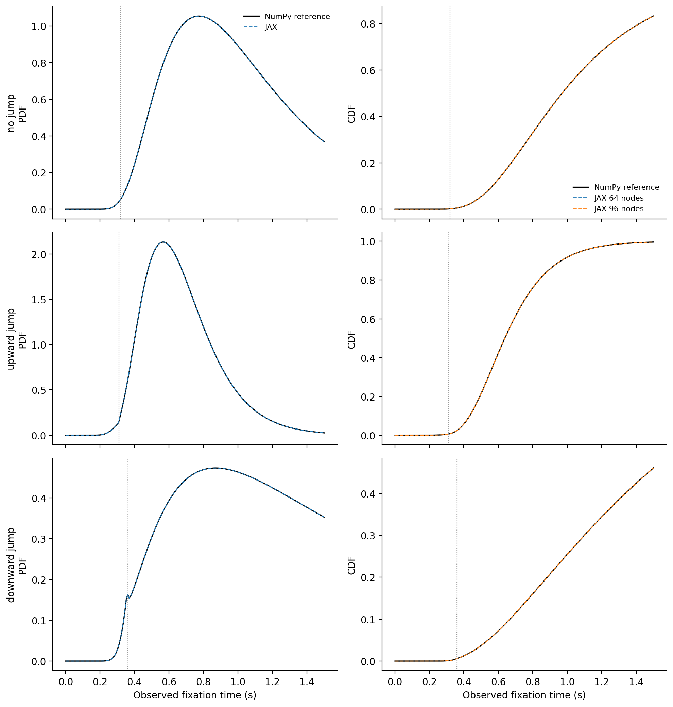

# Results: 2026-08-12

Add result entries below this line.

## Proactive LED step-jump JAX likelihood validation

*NumPy reference and JAX proactive step-jump PDF/CDF curves for no-jump, upward-jump, and downward-jump parameter sets. The validated 64-node Gauss-Legendre CDF agrees with the reference at the required tolerance and was selected for fitting.*

Source: `fitting_aborts/validate_numpyro_proactive_led_step_jump_likelihood.py`
Figure: `docs/assets/results/2026-08-12/proactive_led_step_jump_pdf_cdf_validation.png`

## LED7/93 proactive LED step-jump SVI convergence

*One-thousand-step mean negative-ELBO trace for the unweighted bilateral LED-ON plus LED-OFF fit using exact trial-wise t_LED. The patience-12 run checked 50,000 steps and restored the best checkpoint at step 42,000; all losses and 10,000 posterior samples were finite.*

Source: `fitting_aborts/numpyro_svi_proactive_led_step_jump_single_animal.py`
Figure: `docs/assets/results/2026-08-12/led7_93_proactive_led_step_jump_svi_loss.png`
