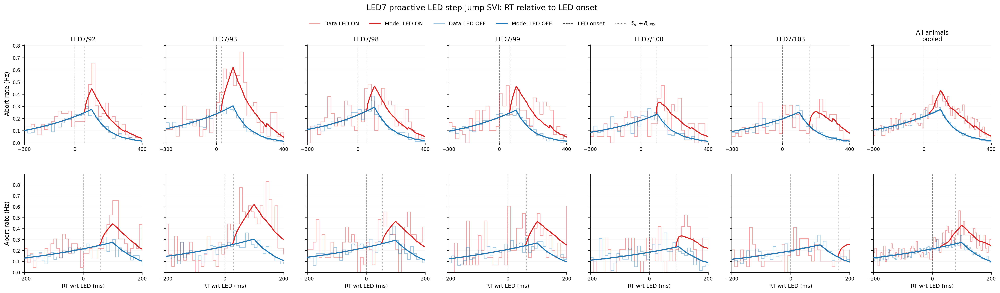
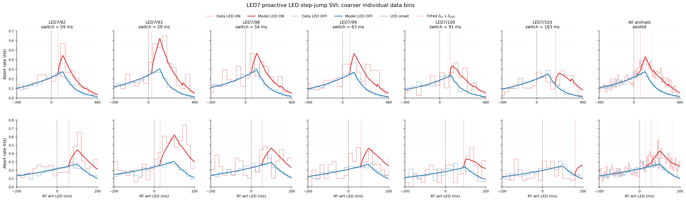

# Results: 2026-08-13

Add result entries below this line.

## LED7 animal-wise RT relative to LED onset

*Data and posterior-mean proactive step-jump SVI theory in RT-relative-to-LED coordinates for six LED7 animals and a pooled seventh column. Individual-animal data use 20 ms bins in the regular view and 10 ms bins in the zoomed view; pooled data retain the FCT-style 10 ms and 5 ms bins. Theory uses 5 ms resolution and 5,000 Monte Carlo draws of intact trial-wise `(t_LED, t_stim)` pairs; the pairwise timing statistics are therefore preserved. The pooled model is a trial-weighted mixture evaluated with each sampled row's animal-specific posterior mean. Both data and model match the fitted 300 ms left truncation and use abort-fraction density scaling. Animals 92, 100, and 103 use their 150k audit fits; animals 93, 98, and 99 use their selected 50k fits.*

Source: `fitting_aborts/plot_numpyro_svi_proactive_led_step_jump_rtwrtled_2x7.py`
Figure: `docs/assets/results/2026-08-13/led7_proactive_led_step_jump_rtwrtled_data_model_2x7.png`

## LED7 RT relative to LED with coarser individual data bins

*Companion visualization of the selected proactive step-jump SVI fits with reduced individual-animal histogram noise. The six animal columns use 40 ms data bins in the regular row and 20 ms bins in the zoomed row; the pooled column retains 10 ms and 5 ms bins. Red dotted lines mark each fitted drift-switch time, `del_m_plus_del_LED`, and the value is printed in each animal title. The pooled panel shows all six switch times because its theory mixes six animal-specific parameter vectors. Model curves, 5 ms theory resolution, 5,000 paired timing draws, 300 ms left truncation, posterior means, and abort-fraction scaling are otherwise unchanged from the original diagnostic.*

Source: `fitting_aborts/plot_numpyro_svi_proactive_led_step_jump_rtwrtled_2x7_coarse_individual_bins.py`
Figure: `docs/assets/results/2026-08-13/led7_proactive_led_step_jump_rtwrtled_data_model_2x7_coarse_individual_bins.png`

## LED7 aggregate proactive step-jump SVI convergence

*One shared five-parameter proactive step-jump model was fit to 71,537 pooled retained trials from LED7 animals 92, 93, 98, 99, 100, and 103. The fit keeps the current animal-wise conventions: bilateral LED ON plus LED OFF, 300 ms left truncation, no lapse component, and unweighted trial contributions. Full-rank SVI stopped at the 50k minimum after patience-12 was satisfied, restored the 50k best window, produced no non-finite losses, and completed in 9.45 minutes.*

Source: `fitting_aborts/numpyro_svi_proactive_led_step_jump_aggregate_led7.py`
Figure: `docs/assets/results/2026-08-13/main_fullrank_loss.png`

## LED7 aggregate RT relative to LED onset

![Pooled LED7 data and theory from one shared aggregate proactive step-jump SVI posterior. The regular panel uses 10 ms data bins over -300 to 400 ms and the zoomed panel uses 5 ms bins over -200 to 200 ms. Theory uses 5 ms resolution and 5,000 intact paired t_LED/t_stim row draws. Data and theory use 300 ms conditional truncation and abort-fraction density scaling. The single fitted drift switch is 51 ms; the former multi-delay shoulders disappear, while the small feature at exactly 300 ms remains aligned with the truncation boundary.](../assets/results/2026-08-13/led7_aggregate_proactive_step_jump_rtwrtled_1x2.png)

*Pooled LED7 data and theory from one shared aggregate proactive step-jump SVI posterior. The regular panel uses 10 ms data bins over -300 to 400 ms and the zoomed panel uses 5 ms bins over -200 to 200 ms. Theory uses 5 ms resolution and 5,000 intact paired t_LED/t_stim row draws. Data and theory use 300 ms conditional truncation and abort-fraction density scaling. The single fitted drift switch is 51 ms; the former multi-delay shoulders disappear, while the small feature at exactly 300 ms remains aligned with the truncation boundary.*

Source: `fitting_aborts/plot_numpyro_svi_proactive_led_step_jump_aggregate_rtwrtled.py`
Figure: `docs/assets/results/2026-08-13/led7_aggregate_proactive_step_jump_rtwrtled_1x2.png`

## LED7 no-truncation lapse SVI convergence

*All six LED7 animal-wise proactive step-jump SVI fits use every LED-ON trial plus LED-OFF, retain aborts below 300 ms, and add the historical exponential lapse mixture. Blue curves are 1k-window mean negative ELBO; green lines mark restored-best checkpoints and red dashed lines mark final checked steps. Every fit reached the 50k minimum, stopped by patience 12, and produced finite posterior samples.*

Source: `fitting_aborts/plot_numpyro_svi_proactive_led_step_jump_no_trunc_exp_lapse_loss_grid.py`
Figure: `docs/assets/results/2026-08-13/led7_no_trunc_exp_lapse_svi_loss_grid.png`

## LED7 no-truncation lapse RT relative to LED

*FCT-matched data and posterior-mean theory for six animal-wise seven-parameter SVI fits plus a pooled seventh column. The fits use all LED-ON and LED-OFF rows, no 300 ms removal or survival renormalization, and an exponential lapse density/survival mixture. Theory uses 5 ms resolution and 5,000 intact paired t_LED/t_stim draws shared between ON and OFF calculations; the pooled model is trial-count weighted. The former truncation-boundary feature is absent.*

Source: `fitting_aborts/plot_numpyro_svi_proactive_led_step_jump_no_trunc_exp_lapse_rtwrtled_2x7.py`
Figure: `docs/assets/results/2026-08-13/led7_no_trunc_exp_lapse_rtwrtled_data_model_2x7.png`
