# Results: 2026-08-29

Add result entries below this line.

## LED OFF full proactive-lapse-reactive RTD validation

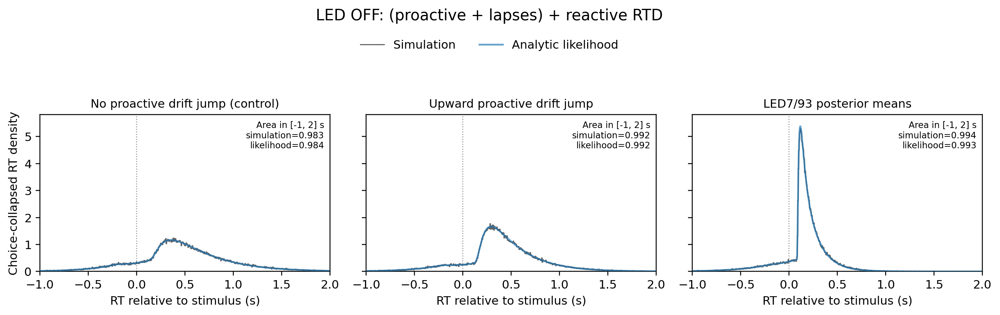

*Choice-collapsed LED-OFF RTD for the full (proactive + exponential random-choice lapse) + NPL+alpha reactive model. Black steps show 100,000 independent simulations per case; blue curves show the summed analytic +1/-1 likelihood. All three cases use the same 128 stratified LED7/93 LED-OFF stimulus times spanning 0.200..2.198 s, so the controlled cases retain realistic timing variability. The downward-jump test is omitted because the behavioral model uses an upward proactive drift jump; the no-jump panel is retained only as a control. Negative RTs are aborts and nonnegative RTs are valid responses. The -1..2 s limits are display-only; neither simulation nor theory is truncated or renormalized.*

Source: `fitting_aborts/plot_proactive_led_step_jump_npl_alpha_lapse_choice_collapsed_rtd.py`
Figure: `docs/assets/results/2026-08-29/led_off_with_lapse_choice_collapsed_rtd_minus1_to2s.png`

## LED ON full proactive-lapse-reactive RTD validation

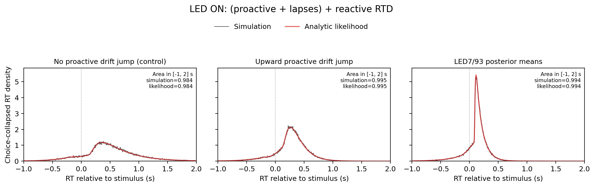

*Choice-collapsed LED-ON RTD for the full (proactive step-jump + exponential random-choice lapse) + NPL+alpha reactive model. Black steps show 100,000 independent simulations per case; red curves show the summed analytic +1/-1 likelihood using the trial-timed upward proactive drift jump. All three cases use the same 128 stratified LED7/93 LED-ON timing rows, preserving each observed `t_stim`/`t_LED` pair; stimulus times span 0.200..2.162 s. The downward-jump test is omitted because the behavioral model uses an upward proactive drift jump; the no-jump panel is retained only as a control. Negative RTs are aborts and nonnegative RTs are valid responses. The -1..2 s limits are display-only; neither simulation nor theory is truncated or renormalized.*

Source: `fitting_aborts/plot_proactive_led_step_jump_npl_alpha_lapse_choice_collapsed_rtd.py`
Figure: `docs/assets/results/2026-08-29/led_on_with_lapse_choice_collapsed_rtd_minus1_to2s.png`

## LED7/98 valid-trial proactive-lapse plus NPL+alpha convergence

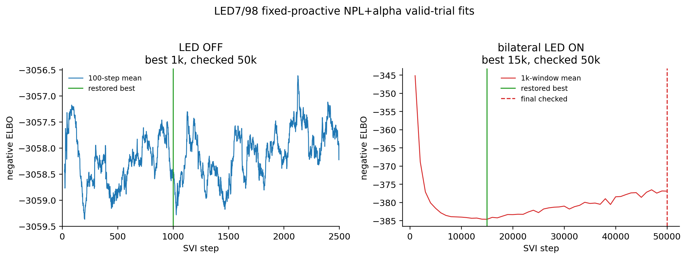

*Separate RT+choice SVI fits used 7,791 LED-OFF valid trials and 1,170 bilateral LED-ON valid trials, each spanning 30 signed ABL/ILD conditions. The OFF panel uses a 100-step rolling mean and is zoomed to steps 0..2,500 so its initial loss decrease and rebound remain visible; its title records that the optimizer was still checked through 50k. The bilateral-ON panel retains the 1k-window means over the complete 50k run. The seven proactive step-jump and exponential-lapse parameters were fixed at posterior means from the accepted LED7/98 all-LED-ON abort fit. OFF restored the 1k checkpoint and bilateral ON restored the 15k checkpoint.*

Source: `fitting_aborts/plot_led7_98_proactive_lapse_npl_alpha_valid_pilot_diagnostics.py`
Figure: `docs/assets/results/2026-08-29/led7_98_valid_npl_alpha_pilot_convergence.png`

## LED7/98 LED-OFF displaced-initialization recovery check

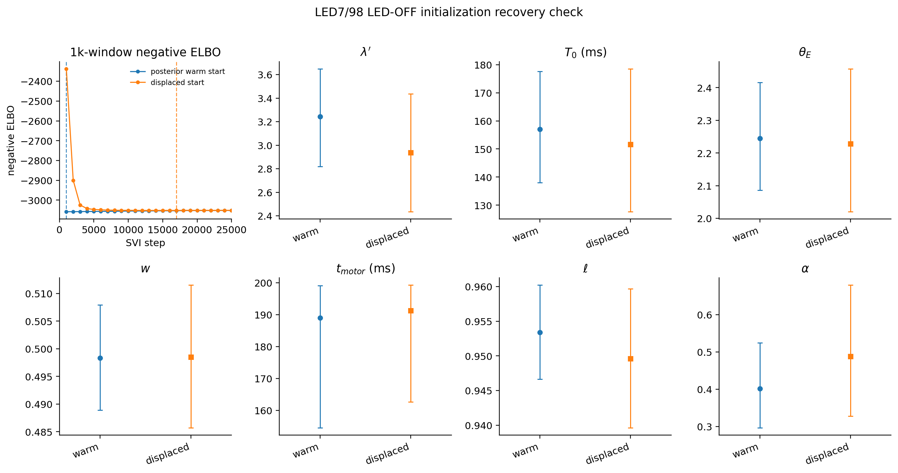

*The independent recovery run retained the previous full-rank covariance but displaced all 37 initial posterior means: `rate_lambda - 0.60`, `T_0 + 40 ms`, `theta_E + 0.60`, `w + 0.04`, `del_go - 40 ms`, `rate_norm_l - 0.04`, `alpha + 0.20`, and every condition delay `+25 ms`. Its 1k-window negative ELBO fell from -2337.19 to -3052.17 and restored the 17k checkpoint after checks through 50k. All seven global 95% intervals overlap the posterior-warm-start fit. The 30 recovered condition-delay means have 1.58 ms RMSE, 3.81 ms maximum absolute difference, and correlation 0.9991 against the warm-start means. The warm-start solution remains the accepted fit because its best window negative ELBO is lower (-3058.29).*

Source: `fitting_aborts/compare_led7_98_off_valid_npl_alpha_initialization_recovery.py`
Figure: `docs/assets/results/2026-08-29/led7_98_off_valid_npl_alpha_displaced_init_recovery.png`

## LED7/98 LED-OFF RTD robustness to initialization

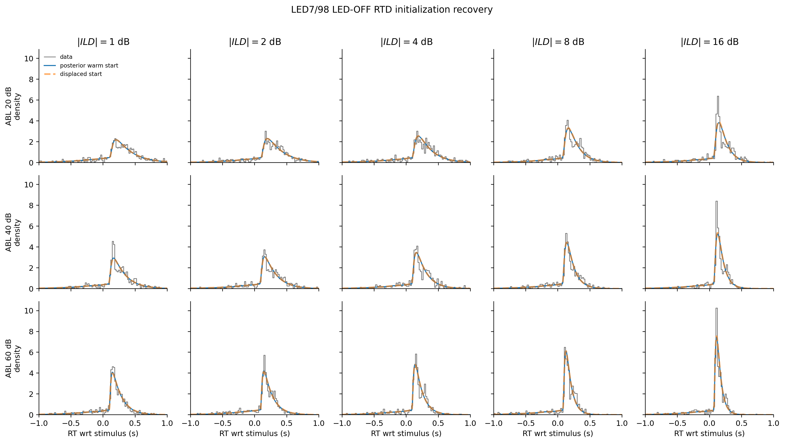

*Black steps are the same 20 ms empirical histograms used in the accepted LED-OFF diagnostic. Blue solid curves use the accepted posterior-warm-start fit; orange dashed curves use the independently optimized displaced-start fit. Both use posterior means, 1 ms theory resolution, both choice bounds, and the identical fixed proactive/lapse parameters and 7,791 fitting trials. The curves are practically unchanged: mean integrated absolute density difference across the 15 cells is 0.0085, the maximum cell value is 0.0168, and displayed probability mass changes by only 0.00016 on average. The accepted blue-only RTD figure is therefore retained rather than replaced.*

Source: `fitting_aborts/compare_led7_98_off_valid_npl_alpha_initialization_recovery.py`
Figure: `docs/assets/results/2026-08-29/led7_98_off_valid_npl_alpha_initialization_rtd_overlay.png`

## LED7/98 OFF and bilateral-ON reactive posterior comparison

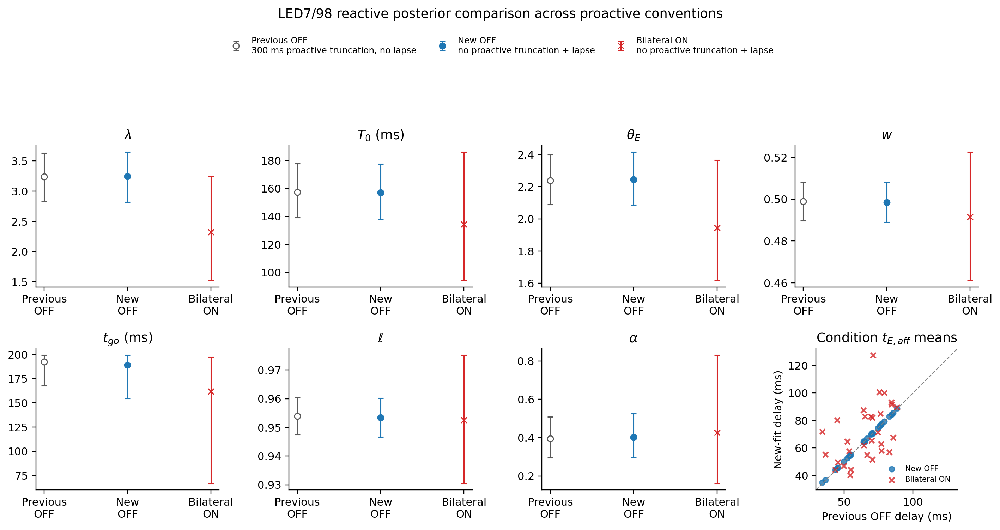

*Posterior means and 95% intervals compare three explicitly labeled conventions. `Previous OFF` is the paper-v2 NPL+alpha condition-delay fit using the older 300 ms proactive-abort truncation and no proactive lapse. `New OFF` and `Bilateral ON` use proactive step-jump and exponential-lapse parameters from the accepted no-proactive-truncation LED7/98 abort SVI fit; the two reactive fits are independent and condition their successful-trial likelihoods on `0 <= RTwrtStim <= 1 s`. The final panel compares all 30 condition-delay posterior means against Previous OFF. Fixed proactive uncertainty is not propagated.*

Source: `fitting_aborts/plot_led7_98_proactive_lapse_npl_alpha_valid_pilot_diagnostics.py`
Figure: `docs/assets/results/2026-08-29/led7_98_valid_npl_alpha_pilot_parameter_comparison.png`

## LED7/98 LED-OFF full RTDs after valid-trial NPL+alpha fitting

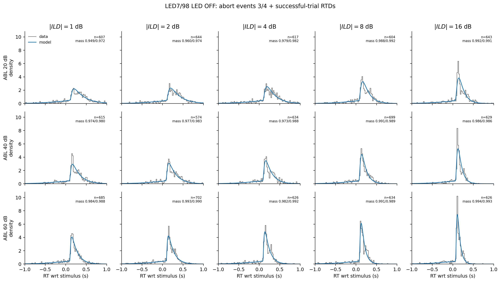

*Choice-collapsed full RTDs for LED7/98 LED OFF. Data include abort events 3 and 4 plus all successful trials; the 37 event-4 rows lie within approximately `0..10 ms` and remove the artificial-looking post-zero dip. The 20 ms histogram counts are divided by every eligible trial in each ABL/absolute-ILD cell, and the exact-timing model average uses that same enlarged denominator. Blue theory uses the restored posterior means, 1 ms resolution, both choice bounds, and exact trial-wise stimulus timings and signed-condition frequencies. The -1..1 s x-range is display-only: neither data nor model is truncated or renormalized, and each panel reports the data/model probability mass visible inside that range. Fixed proactive/lapse values come from the accepted LED7/98 all-LED-ON abort fit; the 15 cells contain 9,539 trials.*

Source: `fitting_aborts/plot_led7_98_proactive_lapse_npl_alpha_valid_pilot_diagnostics.py`
Figure: `docs/assets/results/2026-08-29/led7_98_off_valid_npl_alpha_choice_collapsed_rtds.png`

## LED7/98 bilateral LED-ON full RTDs after valid-trial NPL+alpha fitting

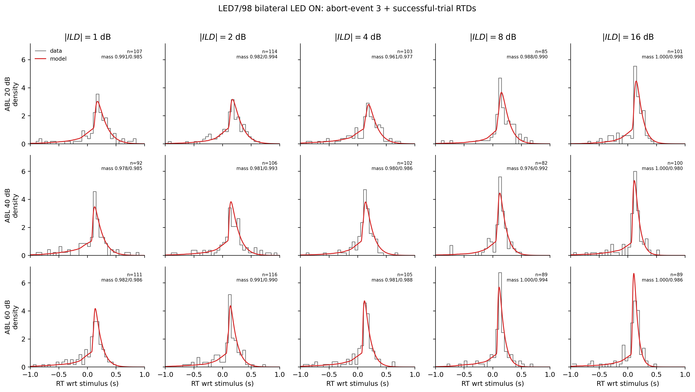

*Choice-collapsed full RTDs for LED7/98 bilateral LED ON. Data include abort-event 3 plus all successful bilateral trials and exclude abort-event 4; 50 ms histogram counts are divided by every eligible trial in each cell. The wider bins reduce sampling noise from the approximately 82..116 trials available per panel. Red theory uses the bilateral-ON restored posterior means, 1 ms resolution, 64-node LED-ON quadrature, both choice bounds, and exact paired trial-wise LED/stimulus timings and signed-condition frequencies. The -1..1 s x-range is display-only: neither data nor model is truncated or renormalized, and each panel reports the visible data/model mass. Fixed proactive/lapse values come from the accepted LED7/98 all-LED-ON abort fit, whose upstream scope also included unilateral ON trials; the 15 cells contain 1,502 trials.*

The table compares the number of eligible trials in each of the 15 ABL-by-absolute-ILD RTD panels. Each panel combines the positive and negative signed ILD conditions. Bilateral LED-ON panels are consistently much smaller than the corresponding LED-OFF panels, explaining why animal-wise ON histograms require wider bins.

| Animal | Bilateral ON panel n (range) | Bilateral ON median | LED OFF panel n (range) | LED OFF median |
|---:|---:|---:|---:|---:|
| LED7/92 | 134-185 | 159 | 902-1049 | 962 |
| LED7/93 | 109-156 | 124 | 692-787 | 721 |
| LED7/98 | 82-116 | 102 | 574-702 | 629 |
| LED7/99 | 81-139 | 104 | 595-709 | 656 |
| LED7/100 | 49-81 | 65 | 358-426 | 400 |
| LED7/103 | 119-154 | 128 | 812-906 | 861 |

Source: `fitting_aborts/plot_led7_98_proactive_lapse_npl_alpha_valid_pilot_diagnostics.py`
Figure: `docs/assets/results/2026-08-29/led7_98_on_bilateral_valid_npl_alpha_choice_collapsed_rtds.png`

## LED7 super-animal valid-trial NPL+alpha convergence

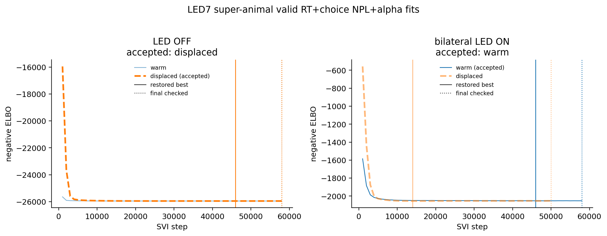

*Trial-weighted pooling across LED7 animals 92, 93, 98, 99, 100, and 103 produced 52,799 LED-OFF and 8,138 bilateral LED-ON successful trials in `0 <= RTwrtStim <= 1 s`, with 30 signed stimulus conditions in each independent 37-parameter RT+choice fit. Blue solid and orange dashed curves show the warm and deliberately displaced starts; solid vertical lines mark restored-best checkpoints and dotted lines mark final checked steps. All four branches patience-converged with finite posteriors and no non-finite losses. OFF accepted the displaced branch after checks through 58k (restored at 46k), while bilateral ON accepted the warm branch after checks through 58k (restored at 46k); both selections used posterior-mean likelihood because their branch ELBOs were within the specified 0.1% tie threshold. The seven proactive step-jump and exponential-lapse parameters were fixed at posterior means from the completed trial-pooled aggregate abort fit. Total fitting time for the four sequential branches was 47.2 minutes. Fit root: `fitting_aborts/numpyro_svi_proactive_led_step_jump_npl_alpha_valid_led7_aggregate_patience12_min50k_restore_best_outputs/LED7_all_animals/`.*

Source: `fitting_aborts/plot_numpyro_svi_proactive_led_step_jump_npl_alpha_valid_led7_aggregate_diagnostics.py`
Figure: `docs/assets/results/2026-08-29/led7_super_animal_valid_npl_alpha_convergence.png`

## LED7 super-animal LED-OFF full RTDs

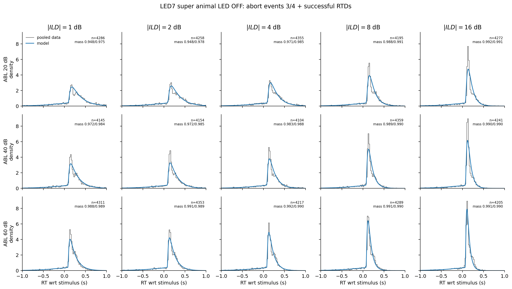

*Black steps are 20 ms empirical histograms from 63,744 pooled LED-OFF rows containing abort events 3 and 4 plus successful trials. The 221 event-4 rows lie within approximately `0..10 ms` and remove the artificial-looking post-zero dip. Counts are divided by every eligible pooled trial in each ABL-by-absolute-ILD cell, without equal-animal weighting, and the exact-timing model average uses the same enlarged denominator. Blue curves use the accepted displaced-start posterior means, both choice bounds, exact trial-wise stimulus timings and signed-condition frequencies, and 1 ms theory resolution. The `-1..1 s` range is display-only: neither data nor model is truncated or renormalized, and each panel reports its eligible trial count and displayed data/model probability mass. Reactive fitting itself used the 52,799 successful `0..1 s` rows; fixed proactive/lapse values came from the completed aggregate all-LED-ON/OFF abort fit.*

Source: `fitting_aborts/plot_numpyro_svi_proactive_led_step_jump_npl_alpha_valid_led7_aggregate_diagnostics.py`
Figure: `docs/assets/results/2026-08-29/led7_super_animal_off_valid_npl_alpha_rtds.png`

## LED7 super-animal bilateral LED-ON full RTDs

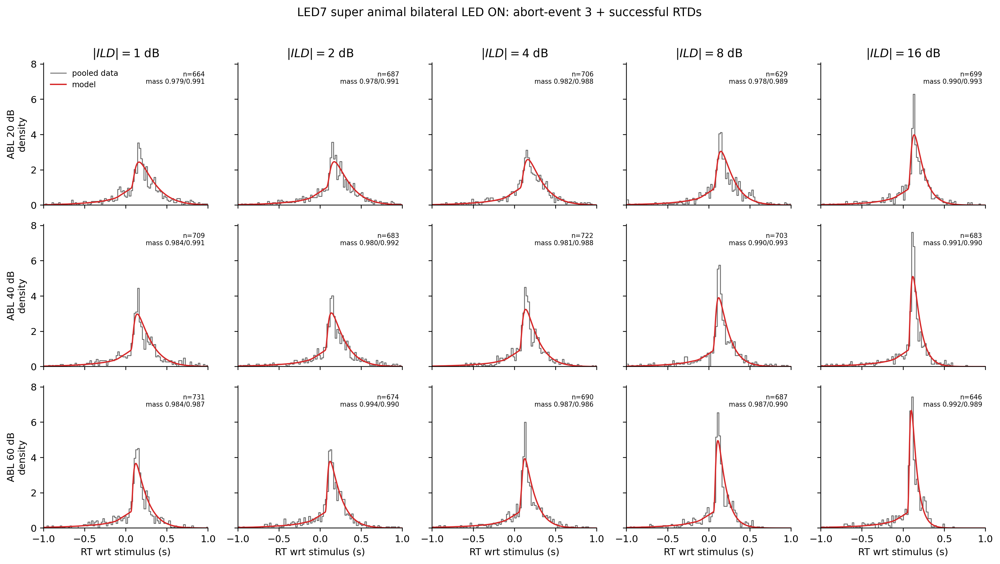

*Black steps are 20 ms empirical histograms from 10,313 pooled bilateral LED-ON rows containing abort-event 3 plus successful trials and excluding event 4. Counts are divided by every eligible pooled trial in each ABL-by-absolute-ILD cell, without equal-animal weighting. Red curves use the accepted warm-start posterior means, both choice bounds, intact trial-wise LED/stimulus timing pairs, exact signed-condition frequencies, 64-node LED-ON quadrature, and 1 ms theory resolution. The `-1..1 s` range is display-only: neither data nor model is truncated or renormalized, and each panel reports its eligible trial count and displayed data/model probability mass. Reactive fitting itself used the 8,138 successful bilateral `0..1 s` rows; fixed proactive/lapse values came from the completed aggregate abort fit, whose upstream LED-ON scope also included unilateral trials.*

Source: `fitting_aborts/plot_numpyro_svi_proactive_led_step_jump_npl_alpha_valid_led7_aggregate_diagnostics.py`
Figure: `docs/assets/results/2026-08-29/led7_super_animal_on_bilateral_valid_npl_alpha_rtds.png`

## LED7 super-animal LED-OFF versus bilateral-ON NPL+alpha posteriors

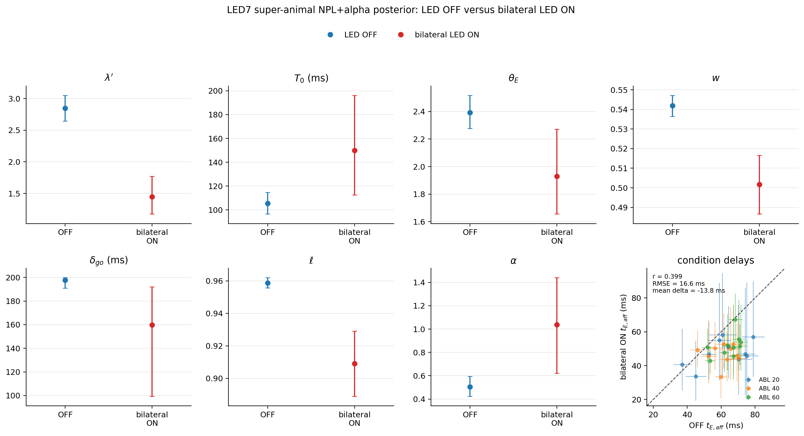

*The first seven panels compare posterior means and 95% credible intervals for the shared NPL+alpha parameters. Blue is the accepted displaced-start LED-OFF fit and red is the accepted warm-start bilateral LED-ON fit. The final panel aligns all 30 `(ABL, ILD)` conditions and plots posterior-mean `t_E_aff` for OFF against bilateral ON; horizontal and vertical bars are the corresponding 95% intervals, colors identify ABL, and the dashed line marks equality. Across the 30 delay means, Pearson `r = 0.399`, RMSE is `16.6 ms`, and mean bilateral-ON minus OFF delay is `-13.8 ms`. The bilateral-ON intervals are generally wider because its independent RT+choice fit used 8,138 trials versus 52,799 for OFF. Both fits fixed the same seven proactive/lapse parameters from the completed trial-pooled aggregate abort fit. Fit root: `fitting_aborts/numpyro_svi_proactive_led_step_jump_npl_alpha_valid_led7_aggregate_patience12_min50k_restore_best_outputs/LED7_all_animals/`.*

Source: `fitting_aborts/compare_led7_super_animal_off_vs_on_npl_alpha_params.py`
Figure: `docs/assets/results/2026-08-29/led7_super_animal_off_vs_on_npl_alpha_parameters.png`

## LED7 super-animal displaced-start-only convergence

![The pooled LED-OFF and bilateral LED-ON 37-parameter RT+choice fits are shown using only their deliberately displaced initialization branches. The LED-OFF branch restored its best 1k-window checkpoint at 46k after checking through 58k; the bilateral LED-ON branch restored 14k after checking through the 50k minimum. Both runs patience-converged with finite losses and posterior samples. This focused convergence view does not modify the existing automated selection record, which currently selects displaced for OFF and warm for bilateral ON.](../assets/results/2026-08-29/led7_super_animal_valid_npl_alpha_convergence_displaced_only.png)

*The pooled LED-OFF and bilateral LED-ON 37-parameter RT+choice fits are shown using only their deliberately displaced initialization branches. The LED-OFF branch restored its best 1k-window checkpoint at 46k after checking through 58k; the bilateral LED-ON branch restored 14k after checking through the 50k minimum. Both runs patience-converged with finite losses and posterior samples. This focused convergence view does not modify the existing automated selection record, which currently selects displaced for OFF and warm for bilateral ON.*

Source: `fitting_aborts/plot_led7_super_animal_valid_npl_alpha_displaced_convergence.py`
Figure: `docs/assets/results/2026-08-29/led7_super_animal_valid_npl_alpha_convergence_displaced_only.png`
