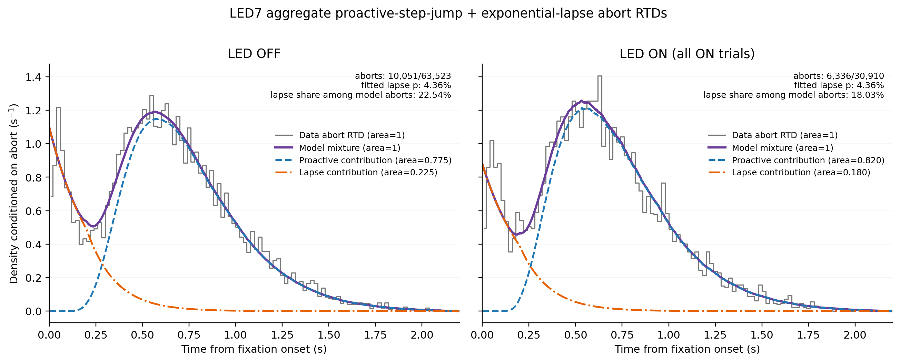

# Results: 2026-09-01

## LED7 aggregate abort RTDs in fixation coordinates

*Trial-pooled LED7 abort RTDs for LED OFF and all LED ON trials from the completed no-truncation proactive-step-jump plus exponential-lapse aggregate SVI fit. Black 20 ms histograms show observed fixation-time abort distributions normalized to area one. Posterior-mean theory uses 1 ms resolution and exact trial-wise stimulus timings, preserving LED/stimulus timing pairs for ON. The weighted proactive and lapse components share the mixture's abort-conditioned normalization and therefore sum pointwise to the area-one model curve. Although the fitted pre-censoring lapse probability is 4.36%, lapses contribute 22.54% of modeled OFF abort density and 18.03% of modeled ON abort density after conditioning on a response before stimulus onset. The data include 10,051/63,523 OFF and 6,336/30,910 ON abort/total rows across animals 92, 93, 98, 99, 100, and 103; all early aborts are retained and ON includes unilateral and bilateral trials.*

Source: `fitting_aborts/plot_led7_aggregate_no_trunc_exp_lapse_abort_rtd_wrt_fixation_components.py`
Figure: `docs/assets/results/2026-09-01/led7_aggregate_no_trunc_exp_lapse_abort_rtd_wrt_fixation_components.png`
