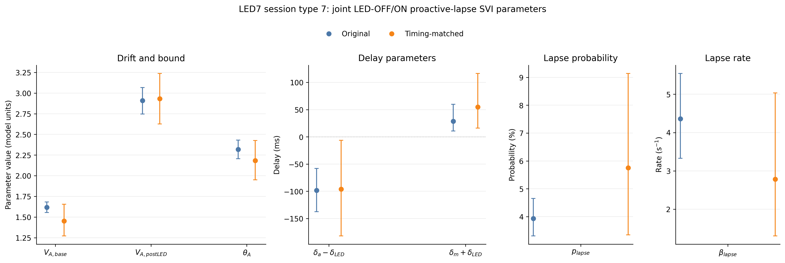
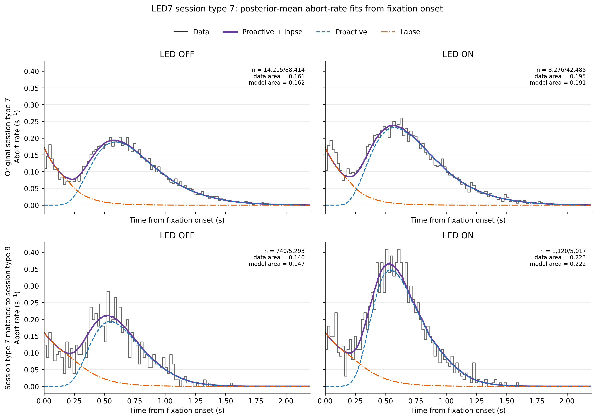
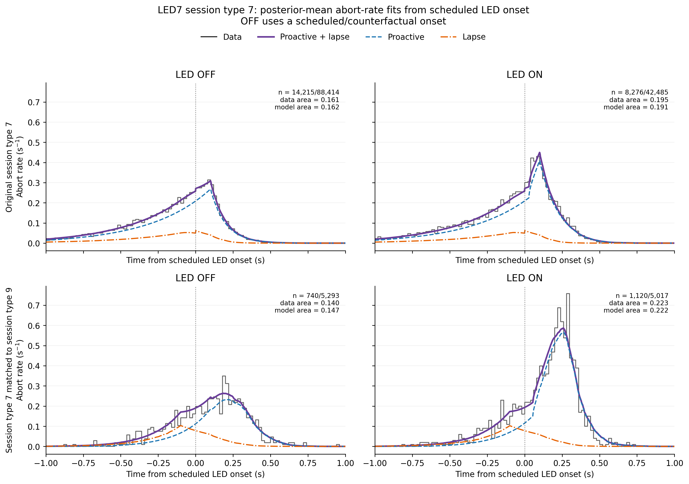
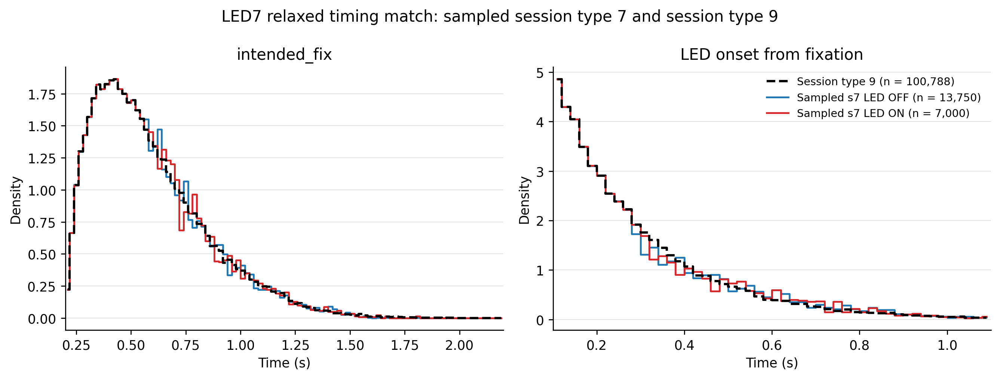
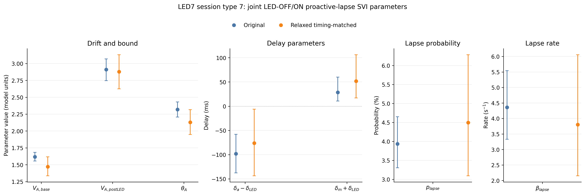
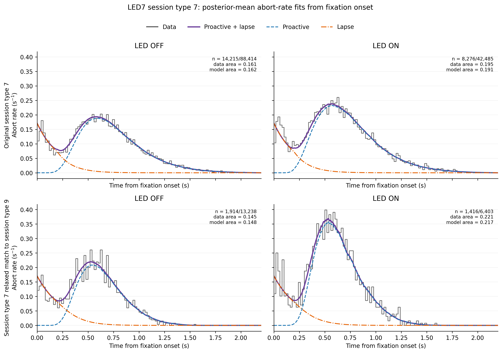
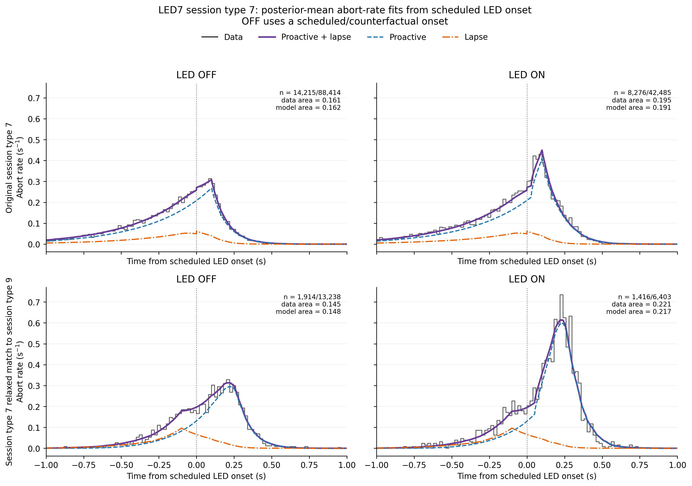
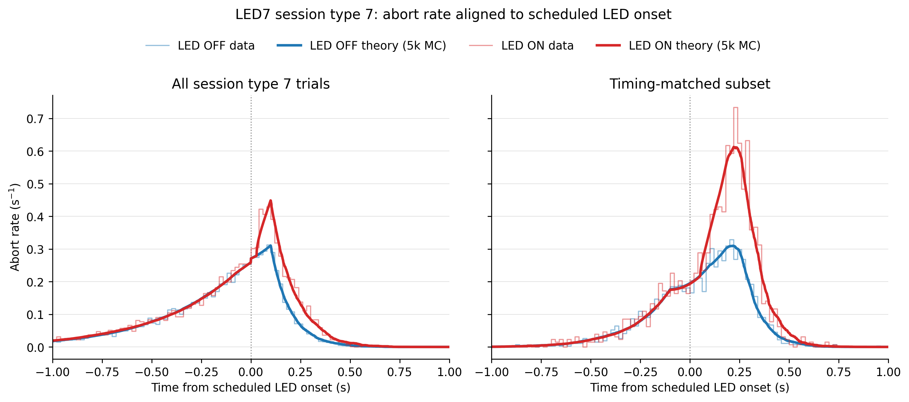
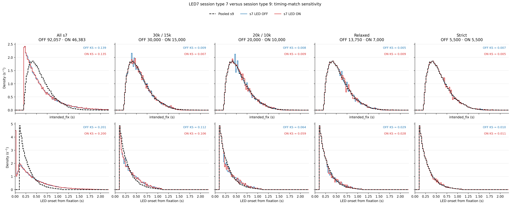

# Results: 2026-09-12

## LED7 session-type-7 abort model: original versus strict timing match

This records the earlier pooled joint LED-OFF/ON SVI fit. Data come from `raw_data/outMatrix_LED7_latest.mat::totalout_stGtACRII` and are filtered to `training_level == 16`, `session_type == 7`, `repeat_trial` in `{0, 2, NaN}`, and `LED_trial` in `{0, 1}`. Session-type-7 scheduled onset is `intended_fix - LED_onset_time`. The strict subset contains 5,500 unique OFF and 5,500 unique ON trials, selected before looking at abort or outcome fields so that the separate 20 ms `intended_fix` and scheduled-onset marginals match the pooled session-type-9 reference. The likelihood contains finite `abort_event == 3` times as event densities and finite `success` in `{-1, +1}` as survival through `intended_fix`; other event codes are excluded and no 300 ms truncation is applied.

The original likelihood contains 14,215 aborts plus 74,199 censored OFF trials and 8,276 aborts plus 34,209 censored ON trials. The strict matched likelihood contains 740 aborts plus 4,553 censored OFF trials and 1,120 aborts plus 3,897 censored ON trials. Three selected OFF event-3 rows have missing `timed_fix` and cannot enter the likelihood.

*Original versus strict timing-matched posterior means and central 95% credible intervals for the seven shared proactive step-jump plus exponential-lapse parameters. Both fits use a full-rank `AutoMultivariateNormal` guide, 64-node quadrature, clipped Adam at `2e-4`, at least 150,000 SVI steps with patience-12 restore-best checks, and 10,000 posterior draws. Animals 90, 92, 93, 98, 99, 100, 102, and 103 are pooled by trial.*

Source: `fitting_aborts/plot_led7_s7_all_vs_s9_timing_matched_no_trunc_exp_lapse_svi_diagnostics.py` 
Fit root: `fitting_aborts/numpyro_svi_led7_s7_all_vs_s9_timing_matched_no_trunc_exp_lapse_outputs/`

*Fixation-aligned theory-versus-data check for the old strict analysis. Empirical 20 ms step-histogram heights are event-3 counts divided by every event-or-censored likelihood trial in the LED group and by 0.020 s. The complete theory and its proactive and lapse components are evaluated at 1 ms resolution and averaged over the exact trial-wise schedules. Panel areas therefore represent absolute abort fractions rather than unit-area conditional distributions.*

Source: `fitting_aborts/plot_led7_s7_all_vs_s9_timing_matched_no_trunc_exp_lapse_svi_diagnostics.py`

*The same old strict model check aligned to scheduled LED onset. For OFF trials, zero is a scheduled or counterfactual onset; actual illumination occurs only on ON trials. The empirical denominator, 20 ms bins, 1 ms theory resolution, and absolute-rate normalization are unchanged from the fixation-aligned figure.*

Source: `fitting_aborts/plot_led7_s7_all_vs_s9_timing_matched_no_trunc_exp_lapse_svi_diagnostics.py`

## Relaxed timing match and new SVI fit

The new match keeps more data while preserving the important timing structure. Using the same fixed seed `20260909` and integer-flow matcher, it retains 13,750 OFF and 7,000 ON session-type-7 trials. The reference remains all 100,788 eligible pooled session-type-9 OFF-plus-ON trials, where scheduled onset is the raw `LED_onset_time`. Matching uses only `intended_fix` and effective scheduled onset; it never uses `abort_event`, `timed_fix`, RT, ABL, ILD, choice, response, or success.

| Sampled s7 group | Selected rows | Likelihood rows | `intended_fix` KS / W1 | Scheduled-onset KS / W1 |
| --- | ---: | ---: | ---: | ---: |
| LED OFF | 13,750 | 13,238 | 0.0054 / 1.80 ms | 0.0286 / 9.71 ms |
| LED ON | 7,000 | 6,403 | 0.0090 / 2.20 ms | 0.0280 / 7.55 ms |

*Unit-area 20 ms timing histograms used to audit the relaxed match. The pooled session-type-9 reference is dashed black; sampled session-type-7 OFF is blue and ON is red. Session-type-7 onset is `intended_fix - LED_onset_time`, whereas session-type-9 onset is raw `LED_onset_time`. The relaxed samples satisfy KS at most 0.030 and Wasserstein distance at most 10 ms for both requested marginals.*

Source: `fitting_aborts/plot_led7_s7_relaxed_s9_timing_match_overlay.py` 
Selection manifest: `fitting_aborts/numpyro_svi_led7_s7_relaxed_s9_timing_matched_no_trunc_exp_lapse_outputs/s7_matched_to_s9/source_row_manifest.csv`

*Original versus relaxed timing-matched posterior means and central 95% credible intervals. The relaxed likelihood contains 1,914 aborts plus 11,324 censored OFF trials and 1,416 aborts plus 4,987 censored ON trials, for 19,641 likelihood rows in total. The new fit is independent, uses the same initialization and seed as the old fits, completes 150,000 finite SVI steps, restores step 39,000, and draws 10,000 posterior samples.*

Source: `fitting_aborts/plot_led7_s7_all_vs_s9_timing_matched_no_trunc_exp_lapse_svi_diagnostics.py` 
Fit root: `fitting_aborts/numpyro_svi_led7_s7_relaxed_s9_timing_matched_no_trunc_exp_lapse_outputs/`

### Posterior estimates

Values are posterior mean `[central 95% credible interval]`. The last column compares the relaxed interval width with the strict matched interval width; negative values are narrower.

| Parameter | Unit | Original s7 | Strict 5,500/5,500 | Relaxed 13,750/7,000 | 95% interval width change |
| --- | --- | ---: | ---: | ---: | ---: |
| `V_A_base` | model units | 1.618 [1.555, 1.683] | 1.453 [1.271, 1.653] | 1.471 [1.335, 1.617] | -26.5% |
| `V_A_post_LED` | model units | 2.910 [2.747, 3.068] | 2.932 [2.626, 3.238] | 2.878 [2.624, 3.131] | -17.2% |
| `theta_A` | model units | 2.318 [2.206, 2.431] | 2.184 [1.951, 2.427] | 2.130 [1.950, 2.317] | -22.8% |
| `del_a_minus_del_LED` | ms | -98.1 [-137.6, -57.9] | -95.9 [-182.0, -6.3] | -76.1 [-143.8, -6.2] | -21.8% |
| `del_m_plus_del_LED` | ms | 28.6 [10.8, 59.9] | 54.9 [16.2, 116.5] | 51.8 [17.1, 106.2] | -11.1% |
| `lapse_prob` | % | 3.93 [3.31, 4.65] | 5.76 [3.34, 9.14] | 4.50 [3.09, 6.28] | -45.0% |
| `beta_lapse` | s^-1 | 4.360 [3.328, 5.543] | 2.781 [1.301, 5.037] | 3.800 [2.149, 6.056] | +4.6% |

Six of seven intervals narrow with the larger relaxed subset. `beta_lapse` is the exception: its interval is 4.6% wider, so the extra rows do not improve every marginal posterior equally.

*Fixation-aligned data and posterior-mean theory for the original and relaxed fits. Empirical curves use 20 ms bins and absolute abort-rate normalization. The relaxed observed versus predicted abort fractions are 0.1446 versus 0.1477 for OFF and 0.2211 versus 0.2172 for ON. Theory is drawn at 1 ms resolution and separates the proactive and exponential-lapse components.*

Source: `fitting_aborts/plot_led7_s7_all_vs_s9_timing_matched_no_trunc_exp_lapse_svi_diagnostics.py`

*Scheduled-onset-aligned version of the same absolute-rate model check. The coordinate change preserves full probability mass. OFF zero remains a scheduled or counterfactual event; only ON trials receive illumination. The complete mixture reproduces the main empirical shape in both relaxed panels, with the remaining bin-scale deviations retained visibly rather than smoothed away.*

Source: `fitting_aborts/plot_led7_s7_all_vs_s9_timing_matched_no_trunc_exp_lapse_svi_diagnostics.py`

The no-truncation exponential-lapse likelihood validator passed its PDF/CDF, full-likelihood, and finite-gradient tests; its mean full-log-likelihood discrepancy from the independent NumPy/SciPy reference was `2.21e-16` per trial.

## LED7 session-type-7 all versus timing-matched abort-rate fits

*Compact scheduled-onset comparison for the pooled joint LED-OFF/ON no-truncation proactive step-jump plus exponential-lapse SVI fits. The left panel uses all eligible session-type-7 likelihood trials; the right uses the relaxed subset whose `intended_fix` and scheduled-onset marginals match session type 9. Within each panel, OFF data/theory are blue and ON data/theory are red on shared x- and y-axes. Data are 20 ms absolute-rate step histograms. Each displayed theory curve is an unsmoothed 1 ms Monte Carlo average over 5,000 intact trial-wise `(scheduled onset, intended_fix)` pairs, sampled uniformly with replacement using seed `20260912`; no abort outcomes are simulated. The four curves took 27.45 s. Against the exact all-schedule averages, absolute mass errors were 0.0024, 0.0058, 0.3085, and 0.0734 percentage points for all-OFF, all-ON, matched-OFF, and matched-ON, respectively; the exact curves remain in the diagnostic payload and are used only for this numerical audit. All-data counts are 14,215/88,414 OFF and 8,276/42,485 ON; matched-subset counts are 1,914/13,238 OFF and 1,416/6,403 ON. Session-type-7 onset is `intended_fix - LED_onset_time`; OFF zero is scheduled or counterfactual, whereas actual illumination occurs only for ON. Filters are `training_level == 16`, `session_type == 7`, `repeat_trial` in `{0, 2, NaN}`, and `LED_trial` in `{0, 1}`. Animals 90, 92, 93, 98, 99, 100, 102, and 103 are pooled by trial.*

Source: `fitting_aborts/plot_led7_s7_relaxed_s9_timing_matched_scheduled_onset_compact.py` 
Original fit root: `fitting_aborts/numpyro_svi_led7_s7_all_vs_s9_timing_matched_no_trunc_exp_lapse_outputs/` 
Relaxed fit root: `fitting_aborts/numpyro_svi_led7_s7_relaxed_s9_timing_matched_no_trunc_exp_lapse_outputs/` 
Figure: `docs/assets/results/2026-09-12/led7_s7_all_vs_relaxed_s9_timing_matched_svi_abort_rate_scheduled_onset_1x2.png`

## LED7 timing-match sensitivity across retained sample sizes

*Each column compares pooled session-type-7 LED OFF (blue) and LED ON (red) timing distributions with the same pooled session-type-9 reference (dashed black), after filtering to `training_level == 16`, session type 7 or 9, `repeat_trial` in `{0, 2, NaN}`, and `LED_trial` in `{0, 1}`. The top row is `intended_fix`; the bottom is effective scheduled LED onset, defined as `intended_fix - LED_onset_time` for session type 7 and raw `LED_onset_time` for session type 9. Columns retain all s7 rows, then 30,000/15,000, 20,000/10,000, 13,750/7,000, and 5,500/5,500 OFF/ON rows. The strict and relaxed columns reuse their exact fitted row identities; the two intermediate columns are independent fixed-seed selections. Matching uses the two 20 ms timing marginals before outcome fields are consulted. The annotated unbinned KS distances are achieved after selection, not an objective given to the matcher. Every histogram is a full 0–2.2 s unit-area 20 ms density.*

Source: `fitting_aborts/plot_led7_s7_s9_timing_ks_sensitivity.py` 
Audit: `fitting_aborts/led7_s7_s9_timing_ks_sensitivity_audit.csv` 
Figure: `docs/assets/results/2026-09-12/led7_s7_s9_timing_ks_sensitivity_2x5.png`
