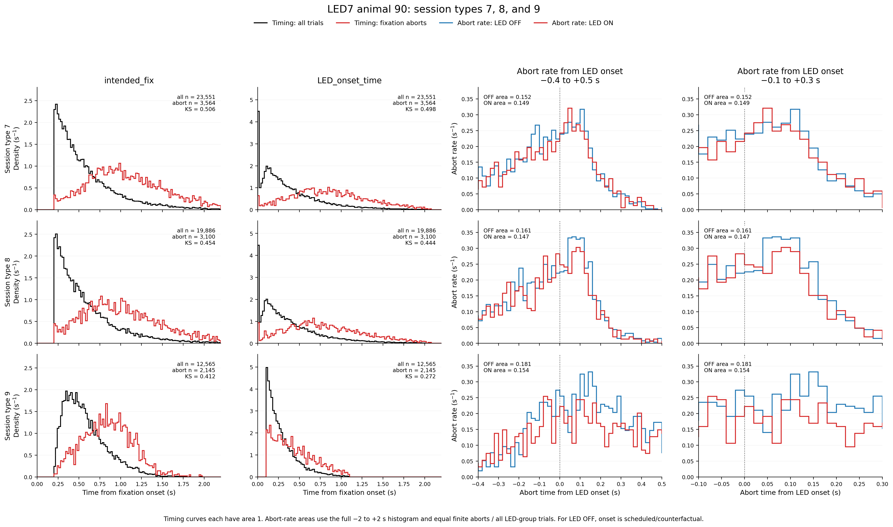
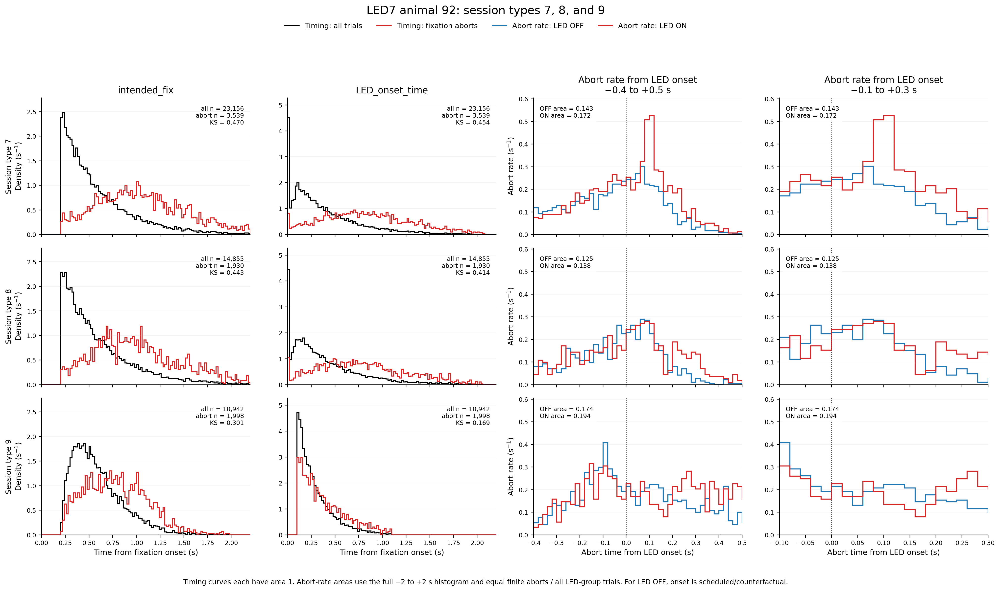
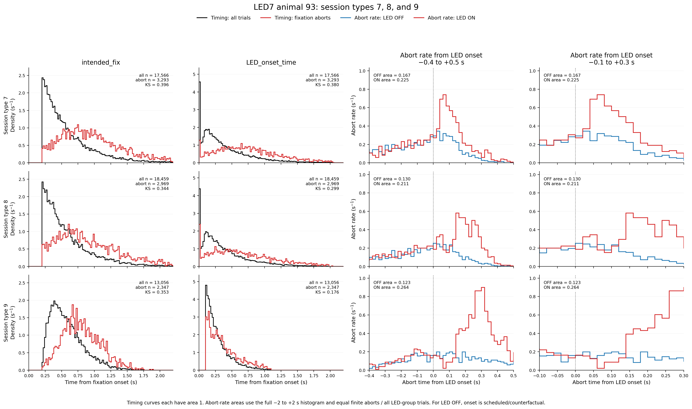
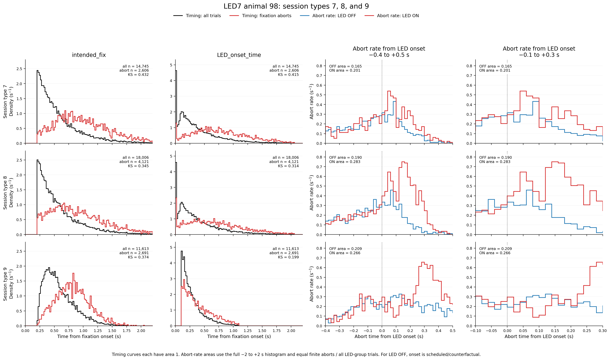
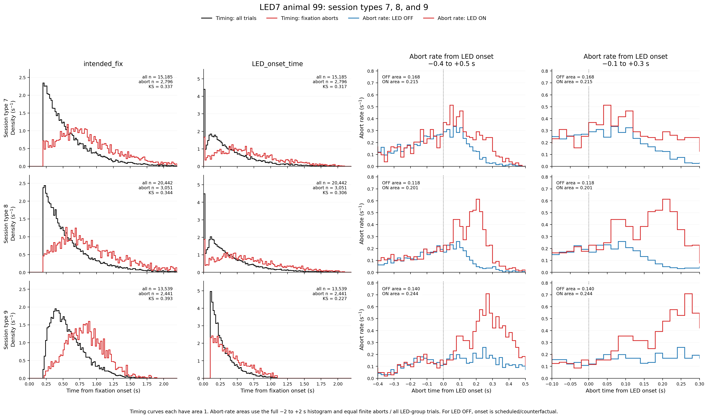
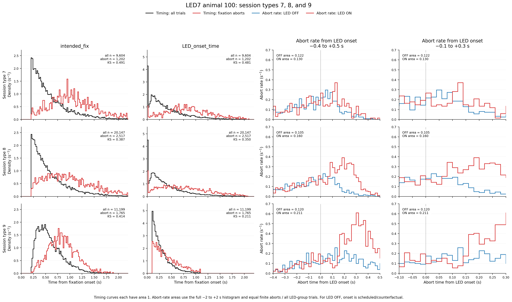
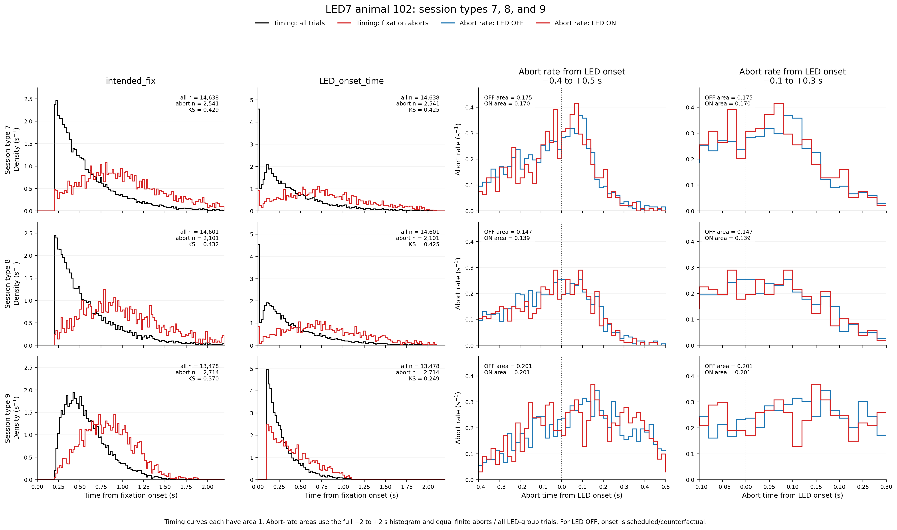
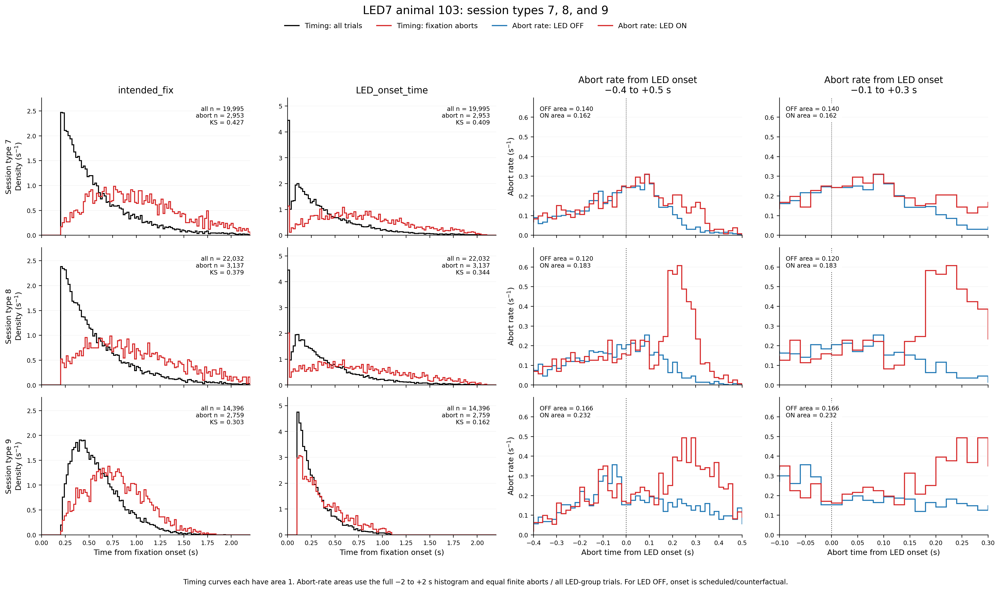
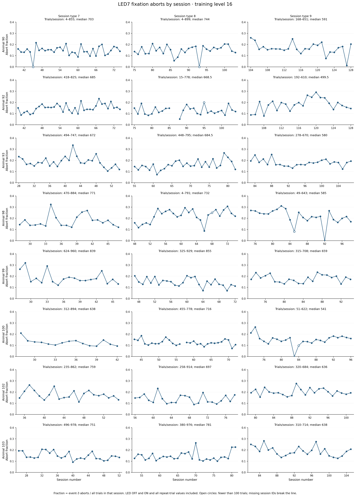

# Results: 2026-09-25

The first nine figures compare LED7 session types 7, 8, and 9 for animals 90, 92, 93, 98, 99, 100, 102, and 103, followed by the trial-pooled aggregate (each trial has equal weight). The source is the standardized `raw_data/LED7_s7.csv`, `LED7_s8.csv`, and `LED7_s9.csv`, plus their event-3 abort CSVs. The CSVs retain training level 16, `repeat_trial ∈ {0, 2, NaN}`, and `LED_trial ∈ {0, 1, NaN}`; no missing LED or repeat categories occur in these subsets. Their single `LED_onset_time` column is fixation-referenced: it was transformed from `intended_fix - LED_onset_time` for session types 7/8 and kept directly for type 9. For LED OFF it is a scheduled, counterfactual onset, not actual illumination.

Columns 1–2 show separate unit-area, 20 ms step histograms for all eligible trials (black) and `abort_event == 3` trials (red). They need not overlap: conditioning on a pre-stimulus abort favors trials with longer scheduled fixation. Columns 3–4 show the **same** 20 ms event-3 abort-rate histograms for LED OFF (blue) and ON (red), aligned to the scheduled onset. The full −2 to +2 s histogram area is the number of finite-timing aborts divided by all trials in that cohort × session type × LED group; the displayed limits are −0.4 to +0.5 s and −0.1 to +0.3 s. Three type-7, two type-8, and six type-9 coded aborts lack `timed_fix`: they remain in trial denominators but cannot enter the rate curves. No SVI model is fitted in these figures.

## LED7 session-type timing and fixation-abort rates: trial-pooled aggregate

*Pooled trials from animals 90, 92, 93, 98, 99, 100, 102, and 103 across session types 7, 8, and 9. Black and red timing densities compare all eligible trials with event-3 aborts; blue and red onset-aligned curves show OFF and ON abort rates, with a regular and x-limit-only zoom view.*

Source: `fitting_aborts/plot_led7_s7_s8_s9_animal_timing_abort_rates.py`
Figure: `docs/assets/results/2026-09-25/led7_aggregate_s7_s8_s9_timing_abort_rate_3x4.png`

For the corresponding aggregate excluding control animals 90 and 102, see the [six-animal result](2026-09-28.md).

## LED7 session-type timing and fixation-abort rates: animal 90

*Animal 90, session types 7, 8, and 9. Black and red timing densities compare all eligible trials with event-3 aborts; blue and red onset-aligned curves show OFF and ON abort rates, with a regular and x-limit-only zoom view.*

Source: `fitting_aborts/plot_led7_s7_s8_s9_animal_timing_abort_rates.py`
Figure: `docs/assets/results/2026-09-25/led7_animal_90_s7_s8_s9_timing_abort_rate_3x4.png`

## LED7 session-type timing and fixation-abort rates: animal 92

*Animal 92, session types 7, 8, and 9. Black and red timing densities compare all eligible trials with event-3 aborts; blue and red onset-aligned curves show OFF and ON abort rates, with a regular and x-limit-only zoom view.*

Source: `fitting_aborts/plot_led7_s7_s8_s9_animal_timing_abort_rates.py`
Figure: `docs/assets/results/2026-09-25/led7_animal_92_s7_s8_s9_timing_abort_rate_3x4.png`

## LED7 session-type timing and fixation-abort rates: animal 93

*Animal 93, session types 7, 8, and 9. Black and red timing densities compare all eligible trials with event-3 aborts; blue and red onset-aligned curves show OFF and ON abort rates, with a regular and x-limit-only zoom view.*

Source: `fitting_aborts/plot_led7_s7_s8_s9_animal_timing_abort_rates.py`
Figure: `docs/assets/results/2026-09-25/led7_animal_93_s7_s8_s9_timing_abort_rate_3x4.png`

## LED7 session-type timing and fixation-abort rates: animal 98

*Animal 98, session types 7, 8, and 9. Black and red timing densities compare all eligible trials with event-3 aborts; blue and red onset-aligned curves show OFF and ON abort rates, with a regular and x-limit-only zoom view.*

Source: `fitting_aborts/plot_led7_s7_s8_s9_animal_timing_abort_rates.py`
Figure: `docs/assets/results/2026-09-25/led7_animal_98_s7_s8_s9_timing_abort_rate_3x4.png`

## LED7 session-type timing and fixation-abort rates: animal 99

*Animal 99, session types 7, 8, and 9. Black and red timing densities compare all eligible trials with event-3 aborts; blue and red onset-aligned curves show OFF and ON abort rates, with a regular and x-limit-only zoom view.*

Source: `fitting_aborts/plot_led7_s7_s8_s9_animal_timing_abort_rates.py`
Figure: `docs/assets/results/2026-09-25/led7_animal_99_s7_s8_s9_timing_abort_rate_3x4.png`

## LED7 session-type timing and fixation-abort rates: animal 100

*Animal 100, session types 7, 8, and 9. Black and red timing densities compare all eligible trials with event-3 aborts; blue and red onset-aligned curves show OFF and ON abort rates, with a regular and x-limit-only zoom view.*

Source: `fitting_aborts/plot_led7_s7_s8_s9_animal_timing_abort_rates.py`
Figure: `docs/assets/results/2026-09-25/led7_animal_100_s7_s8_s9_timing_abort_rate_3x4.png`

## LED7 session-type timing and fixation-abort rates: animal 102

*Animal 102, session types 7, 8, and 9. Black and red timing densities compare all eligible trials with event-3 aborts; blue and red onset-aligned curves show OFF and ON abort rates, with a regular and x-limit-only zoom view.*

Source: `fitting_aborts/plot_led7_s7_s8_s9_animal_timing_abort_rates.py`
Figure: `docs/assets/results/2026-09-25/led7_animal_102_s7_s8_s9_timing_abort_rate_3x4.png`

## LED7 session-type timing and fixation-abort rates: animal 103

*Animal 103, session types 7, 8, and 9. Black and red timing densities compare all eligible trials with event-3 aborts; blue and red onset-aligned curves show OFF and ON abort rates, with a regular and x-limit-only zoom view.*

Source: `fitting_aborts/plot_led7_s7_s8_s9_animal_timing_abort_rates.py`
Figure: `docs/assets/results/2026-09-25/led7_animal_103_s7_s8_s9_timing_abort_rate_3x4.png`

## LED7 fixation-abort fraction by session

*Each panel uses actual session IDs for one animal and session type (7, 8, or 9). Titles report the minimum–maximum and median of per-session trial counts in that panel. Fraction = count(`abort_event == 3`) / all training-level-16 trials in that animal-session; no repeat-trial, LED-trial, success, or timing filter is applied. Open circles mark sessions with fewer than 100 trials, and missing session IDs break the line. No model fit is shown.*

Source: `fitting_aborts/plot_led7_s7_s8_s9_abort_fraction_by_session.py`
Figure: `docs/assets/results/2026-09-25/led7_s7_s8_s9_abort_fraction_by_session_8x3.png`

The session-fraction figure reads `raw_data/outMatrix_LED7_latest.mat::totalout_stGtACRII` directly and filters **only** `training_level == 16` before selecting session types 7–9. Zero plotted fractions are therefore not caused by excluding repeat or LED categories. **In this plotted subset, `abort_fraction == 0` occurs in exactly four sessions, and every trial in each of those sessions has `abort_event == 2`—there are no zero-rate sessions with a mixture of event codes.** Those sessions are:

| Animal | Session type | Session | Event-3 aborts / all trials | Other coding |
|---:|---:|---:|---:|---|
| 90 | 7 | 45 | 0 / 4 | All four have `abort_event == 2` |
| 90 | 8 | 93 | 0 / 4 | All four have `abort_event == 2` |
| 98 | 9 | 92 | 0 / 165 | All 165 have `abort_event == 2`; all are LED ON |
| 100 | 9 | 83 | 0 / 209 | All 209 have `abort_event == 2`; all are LED ON |

Only the first two are low-count sessions. In **all four**, every trial is coded event 2, has no recorded `time_to_CNP`, `timed_fix`, or `timed_LED`, and occurs in block 1. The configured `max_wait` is 30 s; 380 of 382 trials last approximately 31 s. In the full plotted subset, all 16,946 event-2 rows also lack both `time_to_CNP` and `timed_fix`. This is consistent with trials timing out before fixation began, so these zero fractions do **not** mean the animals completed fixation without aborting. The MAT table alone cannot distinguish animal disengagement from an apparatus or logging problem. In the two long sessions, all scheduled trials are LED ON, but no actual `timed_LED` is recorded. Neighboring sessions for the same animals have event-3 aborts again.

Per-session counts: `fitting_aborts/led7_s7_s8_s9_abort_fraction_by_session_audit.csv`. Zero-session timing and coding audit: `fitting_aborts/led7_s7_s8_s9_zero_abort_sessions_audit.csv`.

## LED7 s7: original parameters under matched timings

![Four-panel comparison using the completed joint LED-OFF/ON proactive step-jump plus exponential-lapse SVI fits. Columns show original s7 data with its fit, relaxed-matched s7 data with its fit, the same matched data with original-fit parameters recalculated over matched timings, and theory from columns 1 and 3 overlaid at fixed original parameters. OFF is blue and ON red; in column 4 solid lines use original timings and dashed lines use matched timings. Data use 20 ms bins divided by all abort-or-censored likelihood trials in the corresponding group. Theory uses posterior means, an unsmoothed 1 ms grid, and 5,000 intact scheduled-onset/intended-fix timing pairs sampled with replacement using seed 20260912. Columns 2 and 3 share the exact same timing draws; column 4 reuses existing curve arrays. Display limits are -1 to +1 s. No new model fitting or timing matching is performed.](../assets/results/2026-09-25/led7_s7_all_vs_relaxed_parameter_transfer_1x4.png)

*Four-panel comparison using the completed joint LED-OFF/ON proactive step-jump plus exponential-lapse SVI fits. Columns show original s7 data with its fit, relaxed-matched s7 data with its fit, the same matched data with original-fit parameters recalculated over matched timings, and theory from columns 1 and 3 overlaid at fixed original parameters. OFF is blue and ON red; in column 4 solid lines use original timings and dashed lines use matched timings. Data use 20 ms bins divided by all abort-or-censored likelihood trials in the corresponding group. Theory uses posterior means, an unsmoothed 1 ms grid, and 5,000 intact scheduled-onset/intended-fix timing pairs sampled with replacement using seed 20260912. Columns 2 and 3 share the exact same timing draws; column 4 reuses existing curve arrays. Display limits are -1 to +1 s. No new model fitting or timing matching is performed.*

Source: `fitting_aborts/plot_led7_s7_all_vs_relaxed_parameter_transfer.py`
Figure: `docs/assets/results/2026-09-25/led7_s7_all_vs_relaxed_parameter_transfer_1x4.png`

The saved fits pool animals 90, 92, 93, 98, 99, 100, 102, and 103 with filters `training_level == 16`, `session_type == 7`, `repeat_trial ∈ {0, 2, NaN}`, and `LED_trial ∈ {0, 1}`. Finite event-3 trials contribute aborts and finite `success ∈ {-1, +1}` trials contribute censoring at `intended_fix`. There is no 300 ms truncation or LED-power filter. Original OFF/ON abort counts and likelihood denominators are 14,215/88,414 and 8,276/42,485; the relaxed subset has 1,914/13,238 and 1,416/6,403. For OFF, zero denotes the scheduled/counterfactual onset. The saved `effective_scheduled_onset` column already equals the fixation-referenced s7 onset, `intended_fix - LED_onset_time` from the MAT table.

For column 3, each sampled matched timing pair is evaluated at fixation time `relative_time + effective_scheduled_onset`, retaining density only from fixation onset to that trial's `intended_fix`. Both proactive and lapse terms use the original seven posterior means. Thus the curve is recalculated over the matched timing distribution; the original curve is not copied into the matched-data panel.

| Timing data | Parameters | LED | Observed abort fraction (%) | Predicted, all timings (%) | Plotted MC full area (%) | RMSE in ±1 s (s⁻¹) |
|---|---|---|---:|---:|---:|---:|
| Original | Original fit | OFF | 16.078 | 16.176 | 16.173 | 0.00629 |
| Original | Original fit | ON | 19.480 | 19.145 | 19.150 | 0.01270 |
| Matched | Matched fit | OFF | 14.458 | 14.769 | 14.461 | 0.01322 |
| Matched | Matched fit | ON | 22.115 | 21.718 | 21.645 | 0.03293 |
| Matched | Original fit | OFF | 14.458 | 14.844 | 14.525 | 0.01326 |
| Matched | Original fit | ON | 22.115 | 21.756 | 21.679 | 0.03425 |

Predicted fractions average analytic CDF probabilities over every likelihood timing pair. Plotted MC areas integrate the 5,000-pair theory over the full −2.2 to +2.2 s grid, including tails outside the displayed range. RMSE compares theory averaged into 20 ms bins against the data. The maximum difference between a curve integral and the analytic CDF for its **same sampled pairs** is 0.0000118 in fraction units; the separate Monte Carlo sampling difference from the full timing population reaches 0.3192 percentage points. The first four MC curve integrals reproduce the previous 1 × 2 audit within numerical tolerance.

The original parameters give similar agreement with the matched data to the matched fit. Holding those parameters fixed, changing timings moves the ON theory peak from approximately 100 ms to 221 ms after scheduled onset (column 4). This demonstrates the timing-distribution effect within this model.

Original fit: `fitting_aborts/numpyro_svi_led7_s7_all_vs_s9_timing_matched_no_trunc_exp_lapse_outputs/s7_all/` 
Matched fit: `fitting_aborts/numpyro_svi_led7_s7_relaxed_s9_timing_matched_no_trunc_exp_lapse_outputs/s7_matched_to_s9/` 
Previous figure source: `fitting_aborts/plot_led7_s7_relaxed_s9_timing_matched_scheduled_onset_compact.py` 
Numerical audit: `fitting_aborts/led7_s7_all_vs_relaxed_parameter_transfer_1x4_audit.csv` 
Curves, posterior means, and sampled row identities: `fitting_aborts/led7_s7_all_vs_relaxed_parameter_transfer_1x4_curves.npz`
