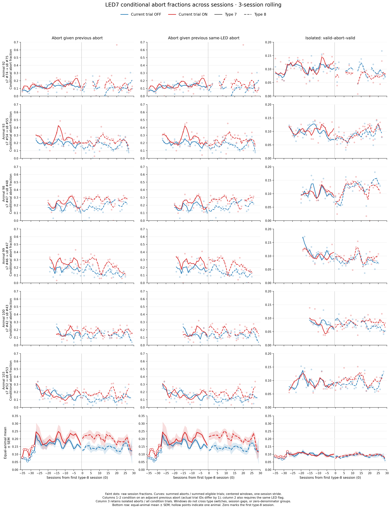

# Results: 2026-09-30

Add result entries below this line.

## LED7 conditional abort fractions across sessions

*Session-type-7 and type-8 trials are aligned so session 0 is the first type-8 session. Fractions use centered three-session windows advanced one session at a time; type-7/type-8 curves are solid/dashed. The bottom row shows the equal-animal mean ± SEM.*

The formulas are evaluated separately for the **current trial’s LED condition** (OFF or ON):

- **Column 1 — abort given previous abort:** `(event-3 abort, event-3 abort) / (event-3 abort, ANY current outcome)`. The previous trial must be immediately adjacent by its `trial` ID.
- **Column 2 — abort given previous same-LED abort:** for ON, `(ON event-3 abort, ON event-3 abort) / (ON event-3 abort, ANY ON current outcome)`; for OFF, the equivalent OFF pair. The previous trial must be immediately adjacent by its `trial` ID.
- **Column 3 — isolated abort:** `(valid, event-3 abort, valid) / all eligible trials in the current LED condition`, where valid means `success` is −1 or +1.

Windows do not cross missing sessions, undefined denominators, or the type-7/type-8 boundary. In the animal rows, columns 1–2 use a 0–0.70 y-axis and column 3 uses 0–0.20; all three bottom-row panels use 0–0.35.

Source: `fitting_aborts/plot_led7_s7_s8_conditional_abort_fractions_transition_rolling.py`
Figure: `docs/assets/results/2026-09-30/led7_s7_s8_conditional_abort_fractions_transition_roll3_7x3.png`
